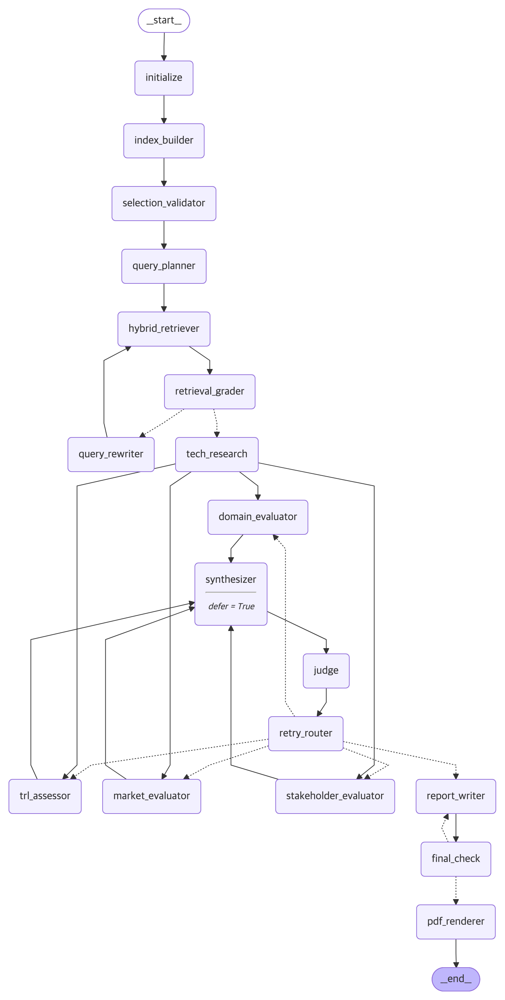

# Subject
본 프로젝트는 KV cache 최적화 기술을 소프트웨어, 하드웨어 두 진영에서 선정하여,
기술 성숙도(TRL)·시장·이해관계자·도메인 관점에서 평가하는 Agentic RAG를 개발하는 프로젝트 임.


## Overview
- Objective : 하나의 기술을 복수 관점에서 비교 평가 (우열·추천 판정 없이, 관점별 인식 차이와 그 근거·조건을 추적)
- Method : Multi-Agent(Distributed) + Agentic RAG
- Tools : LangGraph, LangChain, FAISS, BM25(rank-bm25), sentence-transformers, Tavily, PyMuPDF, LangSmith, uv
- 결과물 : 평가 보고서 `deliverables/RAG-Output_판교_9반_김정인+김지수+김진수+전진만+정원준.pdf` (그래프 실행으로 자동 생성)


## Selected Technologies
- SW : **Google TurboQuant** — 재학습 없이 서빙 단계에서 KV cache를 온라인 양자화(data-oblivious). 무작위 회전 + 좌표별 scalar quantization, 잔차 1-bit QJL로 내적 추정 편향을 보정
- HW : **ITME (SK hynix)** — KV를 양자화하지 않고 CXL-hybrid 메모리(TB급, byte-addressable)로 저장 공간을 확장. vLLM 위에 구현, 양산급 CMM·FPGA 프로토타입으로 실측
- 공정 비교 근거 : 두 기술은 **같은 KV cache 용량 병목을, 같은 서빙 시점에서, 서로 다른 시스템 계층**(데이터 표현 vs 메모리 계층)으로 해결함. 후보 6개(Doc Pool)를 가중 기준표로 채점(TurboQuant 4.35, ITME 4.50)해 조가 직접 선정(2안)하고, 에이전트(`selection_validator`)는 원문 근거로 사후 검증만 수행


## Features
- 찬반 양면 검색과 원 출처 계열 50% 규칙 : 관점마다 두 기술에 같은 지지·반대 질의 템플릿을 쓰고, 기술 고유(`tech_specific`) 근거만 찬반 할당량으로 인정. 같은 보도자료를 옮긴 기사는 한 원 출처 계열(`origin_group`)로 묶고, 한 계열이 웹 근거의 50%를 넘지 않게 함. 개발사(Google·SK hynix) 발언은 이해관계자 점수에서 제외
- Judge 선택적 재실행 : Judge(gpt-4.1)가 설계서 D.5 판정식으로 미달 관점을 지정하면 `retry_router` 노드가 `Command(goto=[관점 노드명])`로 그 관점만 다시 실행(관점별 최대 2회). 통과 관점은 동결하고, 한도 후에도 미달이면 "판정 불확실"로 보고서 한계점에 기록
- 코드 기반 판정 : C.6 Rubric 근거 조건으로 인식 점수 계산, 관점 간 상충(점수 차 2.0/1.0), 가설 H1(TRL × 시장 3×3 격자), 임계값 ±0.5 민감도를 코드로 계산. LLM은 근거 표시와 해설만 작성
- 한→영 교차언어 임베딩 자체 평가 : 42문항 평가셋으로 후보 4종 비교 후 bge-m3 선정(측정 중 발견한 입력 길이 잘림 등을 바로잡아 구현 조건으로 재측정)
- PDF 자료 기반 정보 추출 : 논문 6편(136p, 한도 200p)을 절 인식 청크 159개로 인덱싱. `tech`·`role` 메타데이터로 1차 근거와 비교 근거 구분
- Agentic RAG : 질의 계획 → 한→영 질의 재작성 → 3중 하이브리드 검색(RRF) + reranker → `retrieval_grader` 품질 판정 → 부족 시 재작성 루프(최대 2회)
- TRL 추정 : 공개 정보 기반 추정임을 명시하고 단일 값이 아닌 범위와 신뢰도로 제시, 상·하한에 근거 계열 연결
- 보고서 자동 생성·검수 : 설계서 E.1 목차, 인용 번호, 본문 인용만 담은 REFERENCE, `final_check`(근거 없는 문장·REFERENCE 일치·SUMMARY 분량·우열 어휘) → 수정 1회 → SKALA 양식 PDF
- 종료 보장·재현성 : 모든 루프에 횟수 한도(공통 검색 2, 관점 내부 2, 관점 재실행 2, 보고서 수정 1), `recursion_limit` 50. LLM 응답·웹 검색 캐시를 저장소에 커밋해 `--offline`으로 API 키 없이 같은 보고서 재생


## Tech Stack
- Framework : LangGraph (1.2.x), LangChain
- LLM/Generator : gpt-4.1-mini (temperature 0, seed 42)
- LLM/Judge : gpt-4.1 (생성 모델과 다른 상위 모델, 같은 계열이라는 한계는 보고서에 명시)
- Retrieval : FAISS(IndexFlatIP) + BM25 3중 RRF(k=60) + bge-reranker-v2-m3 — Hit@1 0.786 · Hit@5 0.976 · MRR@10 0.863 (개발 지표: 구성 선택용 한→영 42문항, 구현 조건 입력 길이 2,048)
- Embedding : BAAI/bge-m3 (후보 4종 자체 교차언어 평가로 선정, min(SW, HW) MRR 기준 진영 간 균형 확인)
- Web Search : Tavily (결과를 날짜와 함께 `data/web_cache/`에 저장)
- Report : SKALA 공식 docx 양식(`report/docx_builder.py`) + LibreOffice PDF 변환, Mermaid 로컬 렌더링


## Agents
- 기술 조사 Agent : 선정 타당성 사후 검증(`selection_validator`), 원문에서 개요·실험 조건·한계 추출(`tech_research`), TRL 범위 추정(`trl_assessor`) — RAG (+Web)
- 시장 평가 Agent : 시장 규모·성장, 상용화·채택 사례, 생태계 지원, 도입 비용 구조 평가(`market_evaluator`) — RAG + Web
- 이해관계자 평가 Agent : 클라우드·데이터센터, GPU·메모리 벤더, 개발자 커뮤니티, 투자·분석·언론 집단별 입장(`stakeholder_evaluator`) — Web
- 도메인 평가 Agent : 데이터센터 장문맥 서빙의 W1(장문맥 배치)·W2(고동시성 다중 턴) 적합 조건·제약(`domain_evaluator`) — RAG + Web
- 평가 종합 Agent : 관점 간 일치·상충 매트릭스와 H1~H4 판정(상충·H1·민감도는 코드 계산, LLM은 해설)(`synthesizer`, defer)
- Judge Agent : 관점별 근거성·중립성·출처 다양성·완결성 채점 + 규칙 검사, 미달 관점 지정(`judge`)
- 보고서 생성 Agent : 목차대로 본문 작성, 인용·REFERENCE 정리(`report_writer`)


## Architecture


- 흐름 : Human 선정(2안) → 초기화 → 인덱스 구축 → 선정 검증(기록만) → 공통 RAG(Loop) → 기술 조사 → 4관점 병렬 평가(Fan-out) → 종합(Fan-in, defer) → Judge → retry_router(선택적 재실행) → 보고서 생성·검수(Loop) → PDF
- 보조 노드 : `initialize`, `index_builder`, `query_planner`, `hybrid_retriever`, `retrieval_grader`, `query_rewriter`, `retry_router`, `final_check`, `pdf_renderer` (에이전트 7개, 노드 18개, State 키 27개)
- 설계 그림(요약본) : `docs/graph_overview.png`, 설계 원문 `docs/DESIGN.md`, 결정 기록 `docs/DECISIONS.md`


## Directory Structure
```
├── app.py                 # 실행 스크립트 (CLI 옵션, offline 자동 전환)
├── config.yaml            # 선정 기술·기술 메타데이터·LLM·코퍼스·검색·그래프 한도·팀 정보
├── agents/                # Agent 모듈 (tech_research, market, stakeholder, domain, synthesis, judge, report_writer)
├── graph/                 # State(27키)·runtime(캐시)·보조 노드(platform)·워크플로(workflow)
├── tools/                 # @tool (paper_retrieve, web_search, summarize_sources), 출처 계열 규칙
├── rag/                   # PDF 로딩·청킹·임베딩·하이브리드 검색
├── prompts/               # 프롬프트 템플릿(C.6 Rubric·C.4 TRL 규칙 원문 포함)
├── tests/                 # 단위 테스트(mock·fixture, API 호출 없음)
├── eval/                  # 임베딩·검색 구성 평가(42문항 평가셋)
├── report/                # SKALA 양식 PDF 빌더, Mermaid 로컬 렌더러
├── scripts/               # 논문 다운로드, 그래프 이미지 렌더링
├── data/                  # LLM·웹 검색 캐시(커밋), 논문 PDF·인덱스(재생성, 커밋 안 함)
├── docs/                  # 설계 원문, 결정 기록, 그래프, 자체 점검, Rubric 점검, 발표 노트
├── deliverables/          # 설계서·평가 보고서 PDF
├── submission/            # 최종 제출 파일 모음(보고서·설계서 PDF, Git 링크, 제출 안내·팀원 설명, 발표 노트)
├── outputs/               # 보고서 Markdown·PDF, 평가 결과, 실행 로그
├── pyproject.toml / uv.lock
└── README.md
```


## Usage
```bash
uv sync
cp .env.example .env                          # OPENAI_API_KEY, TAVILY_API_KEY, LANGSMITH_API_KEY 입력
uv run python app.py                          # 전체 그래프 실행 → outputs/·deliverables/에 평가 보고서 생성

# 옵션
uv run python app.py --offline                # 커밋된 LLM·웹 캐시만 사용(API 키 없이 재현). 키가 없으면 자동 전환
uv run python app.py --tech sw=turboquant,hw=itme
uv run python app.py --no-rerank              # reranker 생략(실행 시간 단축)
uv run python app.py --rebuild-index          # 청크·FAISS 인덱스 다시 만들기

uv run pytest -q                              # 단위 테스트(API 호출 없음)
uv run python scripts/render_graph.py         # docs/graph.png 다시 그리기
```
- 첫 실행은 논문 PDF 6편(arXiv)과 HuggingFace 모델(bge-m3 약 2.2GB, bge-reranker-v2-m3 약 2.2GB)을 내려받는다. PDF 변환에는 LibreOffice가 필요하다.
- `--offline`은 API를 호출하지 않지만 모델·논문 다운로드에는 인터넷이 필요하다. `--no-rerank`나 다른 `--tech`는 캐시에 없는 요청이 생기므로 API 키가 필요하다.


## Contributors
<!-- TODO: 팀 확인 필요 -->
- 김정인 : 평가 관점·채점 Rubric 설계, 보고서 검토
- 김지수 : 기술 조사·후보 평가표 작성, 참고문헌 정리
- 김진수 : RAG 파이프라인·임베딩 평가, LangGraph 에이전트 구현
- 전진만 : 시장·이해관계자 자료 조사, 발표 자료
- 정원준 : README·문서화, 그래프 설계 검토
