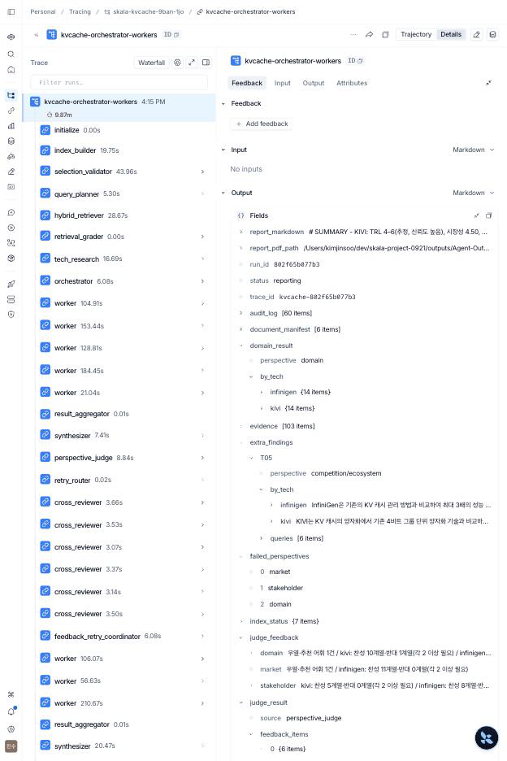

# Subject
본 프로젝트는 KV cache 최적화 기술을 소프트웨어, 하드웨어 두 진영에서 선정하여,
기술 성숙도(TRL)·시장·이해관계자·도메인 관점에서 평가하는 **Orchestrator-Workers** 패턴 기반으로 설계/개발하는 프로젝트 임. (브랜치 `1007`)

## Overview
- Objective : 하나의 기술을 복수 관점에서 비교 평가 (우열·추천 판정 없이 관점별 평가와 그 근거를 추적)
- Pattern : **Orchestrator-Workers** — 필요한 조사 범위가 기술·근거 상태에 따라 달라지므로 실행 전에 계획을 세우고(Orchestrator), 계획된 작업만 병렬 실행한 뒤(Workers) Synthesizer가 병합한다. 보고서 생성은 재현성이 중요해, 매 단계 라우팅하는 Supervisor보다 "사전 계획 + 상한이 있는 피드백 루프"가 맞다
- 동적 처리 : RAG 과제의 고정 4관점 Fan-out(`FAN = [...]`)을 없앴다. Orchestrator가 State(선정 기술·기술 개요·근거·검색 공백)를 보고 SubTask 목록을 런타임에 만들고, `Send`로 `state["subtasks"]` 개수만큼 Worker를 띄운다. 4개 관점은 프롬프트의 최소 커버리지 요건일 뿐이며, 규제·경쟁 등 관점 추가와 관점 분할을 LLM이 정한다. Judge가 실패시킨 작업만 같은 Agent가 1회 다시 실행한다
- 동적 처리 근거 : 입력이 다르면 계획이 달라진다. 계획 단계만 4가지 입력으로 돌리면 SubTask가 7·8·6·8개로 바뀌고(관점의 기술별 분할, 추가 관점, 미사용 Agent가 달라짐), 전체 실행 2회도 TurboQuant+ITME는 5개·검토 8건, KIVI+InfiniGen은 6개·검토 4건으로 달랐다([`docs/PLAN_VARIATIONS.md`](docs/PLAN_VARIATIONS.md), `tracing-5.png`). 같은 입력이면 같은 계획이 나오는 것은 temperature 0과 응답 캐시로 재현성을 보장했기 때문이다

## Selected Technologies
- SW : **Google TurboQuant** — 재학습 없이 서빙 단계에서 KV cache를 온라인 양자화(무작위 회전 + 좌표별 스칼라 양자화 + 1-bit QJL 잔차 보정)
- HW : **ITME (SK hynix)** — KV를 양자화하지 않고 CXL-hybrid 메모리(TB급)로 KV 저장 공간을 확장, vLLM 위에 구현
- 선정 이유 : 같은 병목(KV cache 용량)을 같은 시점(서빙)에서 다른 계층(데이터 표현 vs 메모리 계층)으로 해결한다. 후보 6개를 같은 기준표로 채점(TurboQuant 4.35, ITME 4.50)해 조가 선정했고, `selection_validator`는 원문으로 사후 검증만 한다

## Features
- **PDF 자료 기반 정보 추출** : 논문 6편(136쪽)을 절 인식 청크로 인덱싱하고 bge-m3 FAISS + BM25 3중 RRF + reranker로 검색, 부족하면 질의 재작성(최대 2회)
- **프롬프트 기반 동적 계획** : `prompts/orchestrator.md`에 4개 최소 관점을 커버리지 요건으로 넣고 작업 수·종류·분할·추가 관점은 LLM이 결정. 코드는 검증만 한다(등록 Agent·기술 ID 확인, 중복 제거, 작업 ≤ 8, 최소 관점 누락 보완, 미사용 검토자 1명 이상 확보). 보정 내역은 `plan.repairs`에 기록
- **Dynamic Fan-out + Reducer** : SubTask마다 `Send("worker")`. 결과는 `WorkerResult`로 통일하고 `worker_results` reducer가 task_id 기준으로 병합(병렬 쓰기 보존, 같은 task는 최신 attempt 유지)
- **Worker 실패 Fall-back** : 예외는 `status="error"` 결과가 된다 → attempt 0이면 같은 Agent로 1회 재시도, 다시 실패하면 이전 결과를 `PARTIAL`로 유지하거나 제외(`excluded`)하고 계속 진행, 보고서 한계점에 기록
- **Synthesizer** : `result_aggregator`(defer)가 task별 최신 attempt를 관점 결과로 모으고, `synthesizer`가 관점 간 일치·상충과 가설 H1~H4를 판정(점수·판정은 코드, LLM은 해설)
- **Perspective Judge → 같은 Agent 1회 재시도** : Judge가 실패한 **task_id**를 지목 → `retry_router`(조사하지 않음)가 재시도 가능 여부(attempt == 0)를 코드로 판정 → 초기 계획에서 **쓰이지 않은 Agent**가 REVIEW MODE로 독립 검토(최대 2명, 없으면 생략) → **Agent 0**(`feedback_retry_coordinator`)이 Judge·검토 의견을 재시도 지시문으로 합침 → **원래 담당 Agent**가 attempt 1로 재실행(담당 Agent는 State에서 코드로 고정). attempt 1 후에도 미달이면 `FAILED_AFTER_RETRY`로 기록
- **확증 편향 방지 전략** : 두 기술에 같은 찬반 질의 템플릿·검색 한도를 쓰고, 관점마다 독립 비판 질의(정식 명칭이 있으면 그 이름으로도)를 더한다. 기술명을 명시한 근거만 찬반·집단 점수로 센다(회사 실적·주가·신용등급 기사, SNS 모음 페이지는 기술 평가로 세지 않음). 같은 보도자료를 옮긴 기사는 한 출처 계열로 묶어 한 계열 ≤ 50%로 자르고, 개발사 발언·보도자료·원 논문은 이해관계자 점수에서 뺀다. 실패 작업은 다른 Agent가 출처 편향을 독립 점검한다. 기준에 못 미친 관점의 점수는 보고서에 † 잠정 점수로 표시하고, 반대 근거 0계열·판단 보류·50% 초과 비중은 6장에 수치로 공개한다
- **보고서 품질 평가 (Hybrid)** : `report_quality_evaluator` = 결정적 검사 + LLM Judge(gpt-4.1)
  - Groundedness : 근거 없는 문장 0건, 본문 인용 ↔ REFERENCE 일치 / 중립성 : 우열·추천 어휘 0건 / 편향 통제 : REFERENCE 웹 출처 한 계열 ≤ 50% / 관점 커버리지 : 4개 관점 × 두 기술 결과 존재, SUMMARY·REFERENCE 존재
  - 미달 시 Loop : 서술 문제 → `report_writer` 재작성 1회 / task에 매핑되는 근거 문제이고 attempt 0 → Retry Router 경로 / 이미 재시도한 작업 → 한계 기록 후 결정적 후처리로 종료
- **보고서 10장 이내** : PDF 쪽수를 세어 10쪽을 넘으면 부가 절을 정해진 순서로 빼고 절·인용 번호를 다시 매긴다(SUMMARY, 4개 관점 평가, 가설 판정, 확증편향 방지 결과, REFERENCE는 유지)

## Tech Stack
- Framework : LangGraph 1.2 (`Send` 동적 Fan-out, `defer=True` 합류), LangChain, LangSmith
- LLM/Generator : gpt-4.1-mini (temperature 0, seed 42)
- LLM/Judge : gpt-4.1 (Perspective Judge, Cross Reviewer, Report Quality Judge)
- Retrieval : FAISS + BM25 3중 RRF + bge-reranker-v2-m3 — Hit Rate@1 0.786, Hit Rate@5 0.976, MRR@10 0.863 (한→영 42문항)
- Embedding : BAAI/bge-m3 (오픈소스, 후보 4종 교차언어 자체 평가로 선정)

## Agents
- **Orchestrator** (`agents/orchestrator.py`) : 초기 동적 작업 계획자. State를 보고 SubTask(관점·담당 Agent·기술·목표·필요 근거·성공 기준)를 만든다. 실행 중 라우팅은 하지 않는다
- **Worker Pool** (`agents/registry.py`, 7개)
  - `trl_specialist` · `market_specialist` · `stakeholder_specialist` · `domain_specialist` : 기존 관점 평가 로직(TRL 범위, 시장성 Rubric, 개발사 제외 이해관계자, W1·W2 도메인)
  - `regulation_specialist` · `ecosystem_specialist` · `research_generalist` : 규제, 경쟁·생태계, 비용·배포 제약 등 추가 관점
- **Cross Reviewer** (`agents/cross_review.py`) : 초기 계획에 쓰이지 않은 Agent가 실패 작업을 검토만 한다(Judge 지적의 타당성, 빠진 근거, 출처 편향, 검색 방향). 작업 수행·담당 변경·라우팅은 하지 않는다
- **Agent 0** (`agents/feedback_coordinator.py`) : Judge와 검토 의견을 원래 Agent용 재시도 지시문으로 합친다. 다음에 누가 실행할지는 정하지 않는다
- **Perspective Judge / Report Quality Evaluator** (`agents/judge.py`, `graph/orchestration.py`) : 작업 단위 판정 / 보고서 4항목 판정
- **Synthesizer / Report Writer** (`agents/synthesis.py`, `agents/report_writer.py`) : 관점 병합·가설 판정 / 보고서 작성

## State Schema
`graph/state.py` — 제어 메타, Worker 페이로드, RAG 평가 페이로드를 나눠 선언했다.
- 제어 vs 페이로드 분리 : 제어 메타(`run_id, trace_id, step_count, max_steps, status, last_error, plan, subtasks, used_agents, unused_agents, task_status, judge_result, review_assignments, retry_tasks, report_quality`)와 작업 결과(`worker_results, review_results, extra_findings, evidence, *_result, synthesis, report_markdown, references`)를 분리. 라우터는 제어 메타만 읽는다
- 관측성 위치 : 결정과 사유(계획 근거, 실패 task, 검토자 선정, 재시도 지시, 품질 판정)는 State가 아니라 `outputs/logs/decisions-<run_id>.jsonl`과 LangSmith span 메타데이터로 보낸다. State `audit_log`에는 요약 이벤트만 둔다
- 지속성 비용 : 최종 실행 State는 약 455KB(`evidence` 164건 255KB, `worker_results` 64KB, `audit_log` 67건 28KB). 논문 인덱스·웹 원문·LLM 응답은 `data/` 캐시에 두고 State의 근거에는 요약(≤ 1,200자)과 출처 메타만 둔다. 근거는 ID로 병합되고 검색 예산(라운드 ≤ 3, 결과 ≤ 8)이 고정돼 있으며, `worker_results`는 작업 수, 검토는 작업당 ≤ 2건, 재시도는 작업당 ≤ 1건으로 상한이 있다
- 상관 : `run_id`·`trace_id`를 State, 결정 로그, 실행 요약에 함께 기록하고 LangSmith span 메타데이터에 `run_id, task_id, perspective, assigned_agent, reviewer_agent, attempt`를 붙인다
- 재개/복구 : `subtasks`(attempt 포함) + `task_status`(planned / retrying / passed / FAILED_AFTER_RETRY / PARTIAL / excluded) + `worker_results`로 진행 상황을 복원하고, `last_error`에 마지막 Worker 오류를 남긴다. `build_graph(checkpointer=…)` 지원
- 동시 처리 : 동적 Fan-out에서 동시에 쓰는 키는 모두 reducer — `worker_results`(task_id 병합, 최신 attempt 우선), `evidence`(ID 병합), `review_results`·`retry_tasks`·`audit_log`(누적), `last_error`(결정적 결합), `warnings`(중복 제거)
- 종료 보장 : 피드백 재시도 작업당 정확히 1회, Cross-Review 1단계·최대 2명, 보고서 재작성 1회, 검색 재시도 2회, `max_steps` 40, `recursion_limit` 80

## Architecture


- 코드에서 컴파일한 실제 그래프: [`docs/graph.png`](docs/graph.png) (`uv run python scripts/render_graph.py`)
## LangSmith Trace
최종 실행 `run_id=cdc64c3abebe`(TurboQuant + ITME, 보고서와 같은 실행)와 비교 실행 `run_id=c3a0ce5a880f`(KIVI + InfiniGen). 같은 PNG를 `submission/`에 제출한다.

**tracing-1** — Orchestrator가 실행 전에 SubTask 5개를 계획하고 `dispatch_workers`(Send)가 `worker:T01:trl_specialist:a0` … `worker:T05:research_generalist:a0`를 생성한다(고정 4개 Fan-out이 아님)


**tracing-2** — 전체 경로(접은 트리): worker ×5 → aggregator → synthesizer → judge → retry_router → cross_reviewer ×8(실패 작업마다 미사용 Agent 2명) → feedback_retry_coordinator(Agent 0) → worker ×4(재시도) → judge → report_writer → report_quality_evaluator → pdf_renderer. 오른쪽은 검토 span 메타데이터 `reviewer_agent=ecosystem_specialist`, `assigned_agent=market_specialist`, `mode=review`


**tracing-3** — 재시도 run `worker:T02:market_specialist:a1`의 메타데이터 `assigned_agent=market_specialist`, `attempt=1`, `mode=execute`. 왼쪽 트리의 초기 실행 `worker:T02:market_specialist:a0`와 같은 Agent


**tracing-4** — Agent 0의 작업별 재시도 지시(`agent0:T01~T04`) → `dispatch_retry` → 같은 Agent의 `…:a1` 실행 → 재판정 → 보고서 품질 평가(LLM Judge `report_quality` 호출) → 미해결 근거 문제를 한계로 기록하고 종료


**tracing-5** — 비교 실행: 같은 코드인데 SubTask 6개(추가 관점 비용·구현 위험, 규제), 미사용 Agent 1명이라 검토 4건, 품질 평가 바로 통과 — 입력에 따라 Fan-out 수와 경로가 달라진다


| | 최종 실행 (TurboQuant + ITME) | 비교 실행 (KIVI + InfiniGen) |
|---|---|---|
| SubTask | 5개 (4개 최소 관점 + 비용·구현 위험) | 6개 (4개 최소 관점 + 비용·구현 위험 + 규제) |
| 미사용 Agent → 검토 | 2명 → 8건 | 1명 → 4건 |
| 재시도 | T01~T04 → 재시도 후 미달(† 잠정 점수) | T01~T04 → 재시도 후 미달 |
| 보고서 품질 평가 | 근거 5·중립 5·편향 4·커버리지 4, 결정적 검사 통과, 남은 근거 문제는 한계로 기록 | 통과 |
| 보고서 | [`deliverables/Agent-Output_…pdf`](deliverables/Agent-Output_판교_9반_김정인+김지수+김진수+전진만+정원준.pdf) 10쪽 | (비교용, 제출 안 함) |

## Directory Structure
```
├── app.py                 # 실행 스크립트
├── config.yaml            # 선정 기술·LLM·검색·그래프 한도·팀 정보
├── agents/                # Agent 모듈 (orchestrator, registry, workers, cross_review, feedback_coordinator,
│                          #   tech_research·market·stakeholder·domain·perspective, synthesis, judge, report_writer)
├── graph/                 # 조정 계층 (state, workflow, orchestration: fan-out·router·품질 평가, observability, platform, runtime)
├── prompts/               # 프롬프트 템플릿 (orchestrator, Rubric, TRL 규칙, 보고서)
├── tools/  rag/           # 검색 도구, PDF 로딩·청킹·임베딩·하이브리드 검색
├── report/                # SKALA 양식 PDF 빌더, Mermaid 렌더러
├── data/                  # 문서 풀(논문 PDF는 실행 시 다운로드), LLM·웹 검색 캐시
├── outputs/               # 실행 결과 (보고서 md·docx·pdf, 상태 스냅샷, 로그)
├── deliverables/          # 제출용 평가 보고서 PDF
├── submission/            # 제출 묶음 (Git 링크, tracing PNG, 보고서 PDF)
├── docs/                  # 그래프 그림, LangSmith 캡처(tracing/), 입력별 계획 비교(PLAN_VARIATIONS), RAG 단계 설계 기록
├── eval/  scripts/        # 임베딩·검색 평가, 논문 다운로드·그래프 렌더링·입력별 계획 비교
├── tests/                 # 단위·그래프 테스트 (API 호출 없음)
└── README.md
```

## Usage
```bash
uv sync
python app.py                 # = uv run python app.py
uv run pytest -q              # 테스트 60개, API 호출 없음
```
- API 키 없이 실행하면 offline 재생으로 자동 전환된다. 두 실행(`python app.py`, `python app.py --tech sw=kivi,hw=infinigen`)의 LLM·웹 검색 응답(Orchestrator·Cross Reviewer·Agent 0·품질 Judge 포함)이 `data/`에 커밋돼 있어, 키 없이도 **LLM이 만든 같은 동적 계획**과 같은 보고서가 다시 만들어진다(검증: API 호출 0회, 보고서 동일)
- 캐시에 없는 새 입력을 키 없이 돌릴 때만 규칙 기반 fallback 계획을 쓴다. fallback도 State를 읽어 근거가 불균형하면 관점을 기술별로 나누고 검색 공백·선정 약점이 있으면 조사 작업을 더하며, 실행 요약에 `plan_source=fallback`으로 남는다
- 새로 실행하거나 다른 기술 조합(`--tech`)을 쓰려면 `.env`에 `OPENAI_API_KEY`, `TAVILY_API_KEY`(trace는 `LANGSMITH_API_KEY`)가 필요하다
- 첫 실행은 논문 PDF 6편과 HuggingFace 모델(bge-m3, bge-reranker-v2-m3)을 내려받고, PDF 변환에 LibreOffice가 필요하다

## Contributors
<!-- TODO: 팀 확인 필요 (PM·PL 역할은 적지 않음) -->
- 김정인 : 평가 관점·채점 Rubric 설계, 보고서 검토
- 김지수 : 기술 조사·후보 평가표 작성, 참고문헌 정리
- 김진수 : RAG 파이프라인·임베딩 평가, LangGraph Orchestrator-Workers 구현
- 전진만 : 시장·이해관계자 자료 조사, 발표 자료
- 정원준 : README·문서화, 그래프 설계 검토
