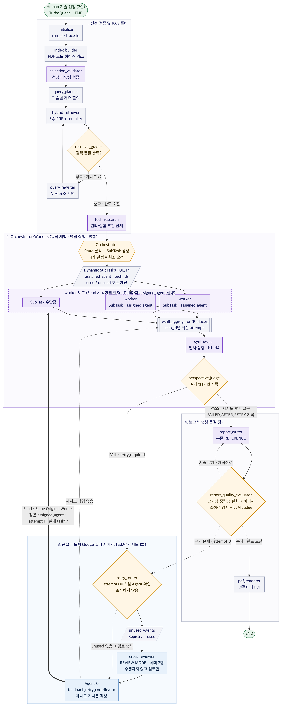
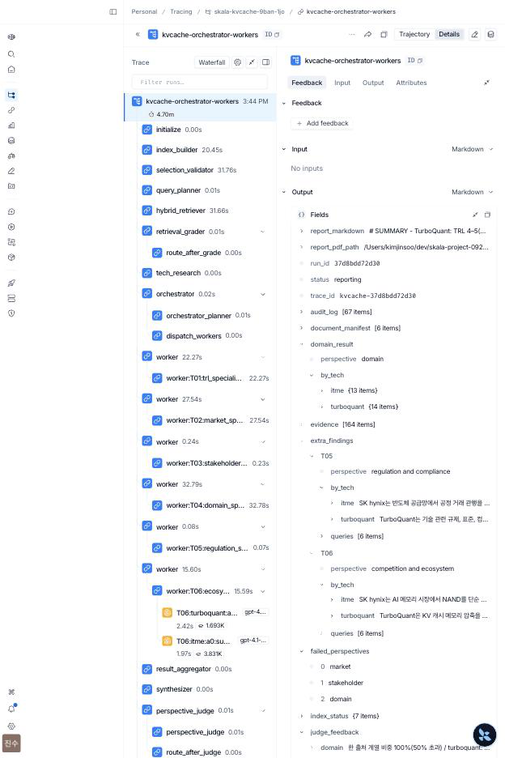
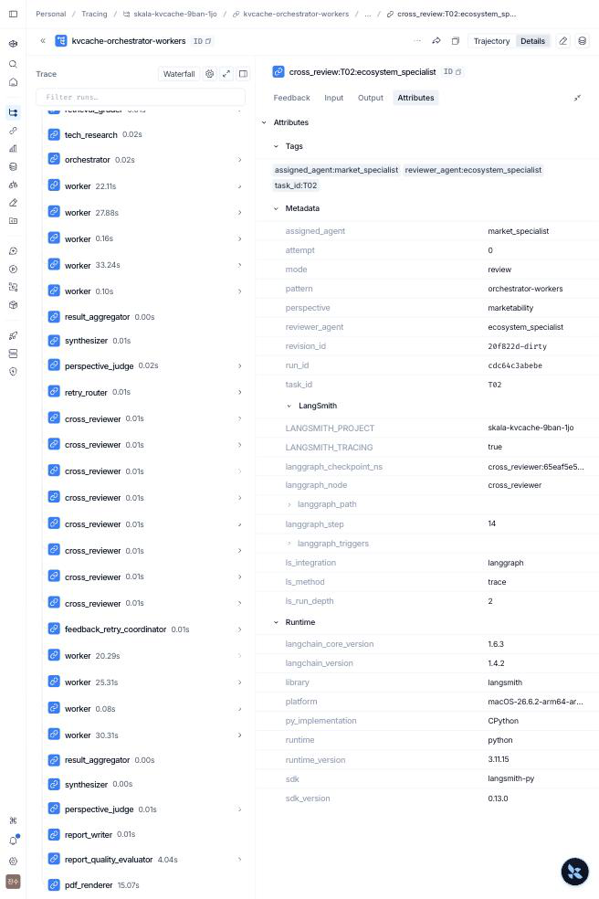
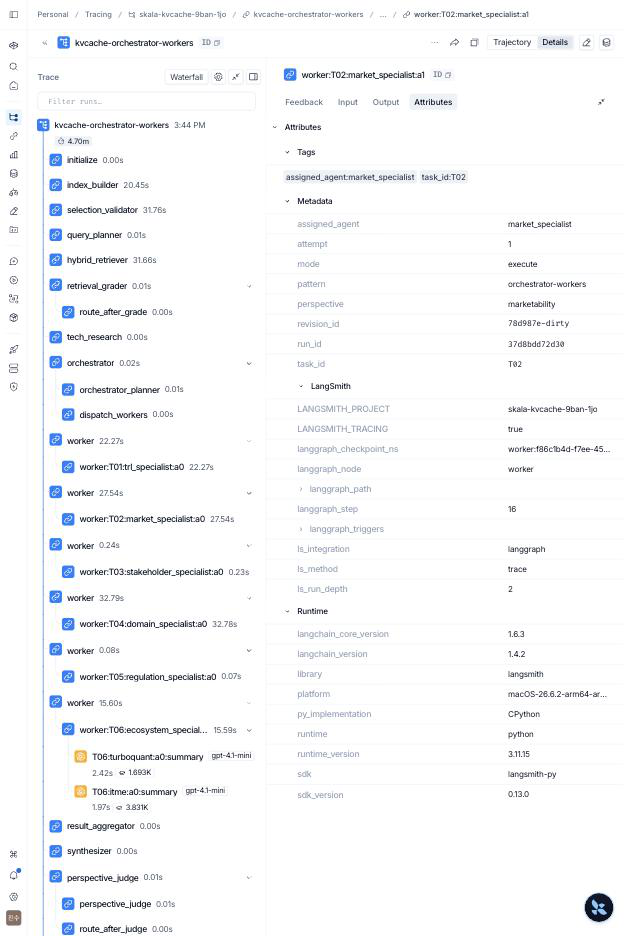
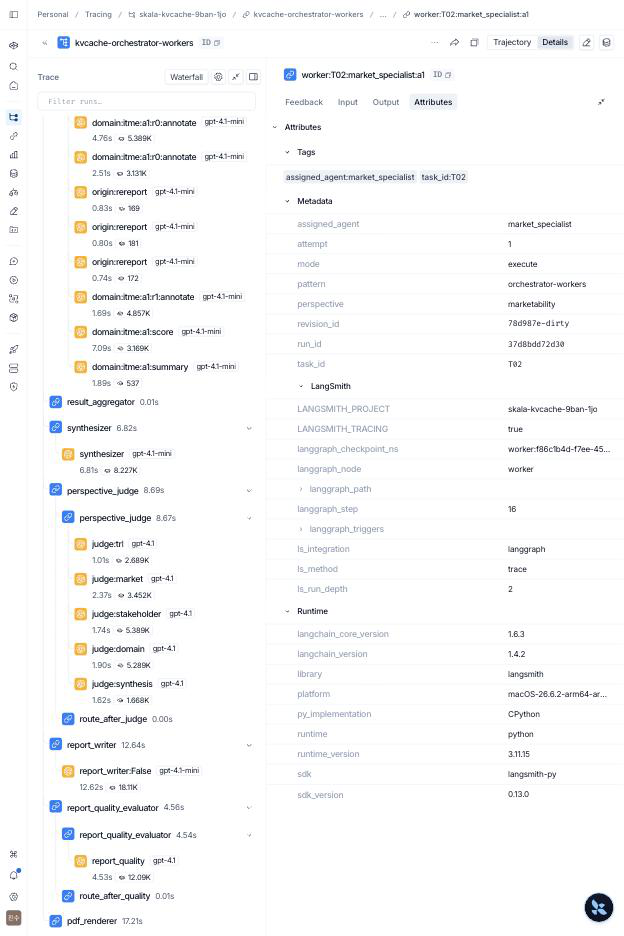

# Subject
본 프로젝트는 KV cache 최적화 기술을 소프트웨어, 하드웨어 두 진영에서 선정하여,
기술 성숙도(TRL)·시장·이해관계자·도메인 관점에서 평가하는 **Orchestrator-Workers** 패턴 기반으로 설계/개발하는 프로젝트 임.
(RAG 과제의 정적 병렬 흐름을 런타임 계획 기반 동적 Multi-Agent로 확장, 브랜치 `1007`)

## Overview
- Objective : 하나의 기술을 복수 관점에서 비교 평가 (우열·추천 판정 없이, 관점별 인식 차이와 그 근거·조건을 추적)
- Pattern : **Orchestrator-Workers** — 평가 관점과 필요한 조사는 기술·근거 상태에 따라 달라지므로, 실행 전에 계획을 세우고(Orchestrator) 계획된 작업만 병렬 실행한 뒤(Workers) 결과를 병합(Synthesizer)하는 구조가 목적에 맞다. 보고서 생성은 재현성이 중요해 매 단계 라우팅하는 Supervisor보다 "사전 계획 + 한정된 피드백 루프"가 적합하다
- 동적 처리 : 기존 RAG 과제는 `FAN = [trl, market, stakeholder, domain]` 고정 Fan-out이었다. 이제 Orchestrator가 State(선정 기술·기술 개요·근거·검색 공백)를 보고 **SubTask 목록을 런타임에 생성**하고, `Send`로 `state["subtasks"]` 개수만큼 Worker를 띄운다. 관점을 기술별로 나누거나(예: 시장성 SW/HW 분리) 규제·경쟁·비용·배포 제약 같은 관점을 추가할 수 있다. 4개 관점은 프롬프트의 **최소 커버리지 요건**일 뿐 고정 작업 목록이 아니다

## Selected Technologies
- SW : **Google TurboQuant** — 재학습 없이 서빙 단계에서 KV cache를 온라인 양자화(무작위 회전 + 좌표별 스칼라 양자화 + 1-bit QJL 잔차 보정)
- HW : **ITME (SK hynix)** — KV를 양자화하지 않고 CXL-hybrid 메모리(TB급)로 KV 저장 공간을 확장, vLLM 위에 구현
- 선정 이유 : 같은 병목(KV cache 용량)을 같은 시점(서빙)에서 서로 다른 계층(데이터 표현 vs 메모리 계층)으로 해결. 후보 6개를 같은 기준표로 채점(TurboQuant 4.35, ITME 4.50)해 조가 선정(Human 2안), `selection_validator`는 원문으로 사후 검증만 한다

## Features
- **PDF 자료 기반 정보 추출** : 논문 6편(136쪽, 한도 200쪽)을 절 인식 청크로 인덱싱, bge-m3 FAISS + BM25 3중 RRF + reranker 하이브리드 검색, 부족하면 질의 재작성(최대 2회)
- **프롬프트 기반 동적 계획 (Orchestrator)** : `prompts/orchestrator.md`에 4개 최소 관점을 *커버리지 요건*으로 넣고 작업 수·종류·분할·추가 관점은 LLM이 결정. 코드는 계획을 검증만 한다(등록된 Agent인지, 기술 ID가 맞는지, 같은 관점·기술 중복 제거, 작업 상한 8개, 최소 관점 누락 시 해당 부분만 보완하고 `plan.repairs`에 기록)
- **Agent Registry와 used / unused Agent** : 7개 Agent 프로필(`agents/registry.py`). 초기 계획의 `assigned_agent` 집합이 `used_agents`, Registry − used가 `unused_agents`이며 **코드로 결정적으로 계산**한다(LLM이 판단하지 않음)
- **동적 Fan-out + Reducer** : `dispatch_workers`가 SubTask마다 `Send("worker", …)`. Worker 결과는 `WorkerResult`로 통일하고 `worker_results` reducer가 task_id 기준으로 병합(병렬 쓰기 보존, 같은 task는 최신 attempt 유지, 정렬된 결정적 순서)
- **Synthesizer 분리** : `result_aggregator`(defer)가 task별 최신 attempt를 관점 결과로 모으고(`worker_results` = 원본), `synthesizer`가 관점 간 상충·가설 H1~H4·민감도를 해석한다(`synthesis` = 해석)
- **Perspective Judge (task_id 단위 피드백)** : 근거성·중립성·출처 다양성·완결성(LLM 1~5점) + 규칙 검사(출처 계열 비중 ≤ 50%, 우열 어휘 0건, 찬반 각 2계열 이상, TRL 상·하한 근거). 결과를 `JudgeFeedbackItem(task_id, reason, missing_evidence, feedback, retry_required)`로 바꿔 **실패한 Task ID를 지목**한다. 예: `T03: itme: 독립된 한계(con) 근거 계열 1개 이상`
- **미사용 Agent의 독립 Cross-Review** : Judge가 실패시키면 `retry_router`가 `unused_agents`에서만 검토자를 고른다(능력 일치 점수, 최대 2명, 원 담당 Agent 제외). 검토자는 **REVIEW MODE**로 원 SubTask·원 WorkerResult·그 결과가 인용한 근거·Judge 피드백만 보고 `ReviewResult`(Judge 동의 여부, 빠진 근거, 간과된 근거 ID, 출처 편향, 검색 방향)를 낸다. 검색·재실행·라우팅·담당 변경은 하지 않는다. unused가 없으면 Cross-Review를 건너뛰고 Agent 0으로 간다
- **Agent 0 (`feedback_retry_coordinator`)** : Judge 피드백 + ReviewResult를 합쳐 "원래 Agent가 정확히 무엇을 개선할지"를 `RetryTask.retry_instruction`으로 만든다. "다음에 누가 실행할지"는 정하지 않는다 — `assigned_agent`는 State의 `SubTask.assigned_agent`에서 코드로 복사하고 LLM 출력은 무시한다
- **같은 원래 Agent가 정확히 1회 재시도** : `dispatch_retry`가 실패한 task만 원 Agent에게 attempt 1로 보낸다(관련 없는 Worker는 재실행하지 않음). attempt 1 후에도 미달이면 `FAILED_AFTER_RETRY`/`PARTIAL`로 기록하고 보고서 한계점에 싣는다(코드 규칙 `MAX_FEEDBACK_RETRY = 1`)
- **Worker 실패 Fall-back** : Worker 예외는 그래프를 멈추지 않고 `status="error"` WorkerResult가 된다 → attempt 0이면 같은 Agent로 1회 재시도, attempt 1도 실패하면 이전 결과를 `PARTIAL`로 유지하거나 없으면 `excluded`(판단 보류 표시) 후 **계속 진행**
- **확증 편향 방지 전략** : 두 기술에 같은 찬반 질의 템플릿·검색 한도, 기술명이 명시된 근거만 찬반으로 계산, 재보도 기사는 원 출처 계열로 묶어 한 계열 ≤ 50%, 개발사 발언은 이해관계자 점수 제외, Cross Reviewer가 출처 편향·단일 계열 지배를 독립 점검
- **보고서 10장 이내 자동 맞춤** : `pdf_renderer`가 렌더링한 PDF 쪽수를 세어 10쪽을 넘으면 부가 절(후보 평가표 → 민감도 → 선정 검증 상세 → 분석 방법 한계 → …)을 정해진 순서로 빼고 절 번호·인용 번호·REFERENCE를 다시 매긴다. SUMMARY, 4개 관점 평가, 일치·상충 표, 가설 판정, 확증편향 방지 결과, REFERENCE는 빼지 않는다. 목차는 장 단위로 SUMMARY와 같은 쪽에 두고, REFERENCE는 8pt로 조판한다
- **보고서 품질 평가 (Hybrid)** : `report_quality_evaluator` = 결정적 검사 + LLM Judge
  - Groundedness : 근거 없는 문장 0건, 본문 인용 ↔ REFERENCE 일치 (코드) + LLM 1~5점
  - 중립성 : 우열·추천 어휘 사전 0건 (코드) + LLM 1~5점
  - 편향 통제 : REFERENCE 웹 출처 한 계열 ≤ 50% (코드) + LLM 1~5점
  - 관점 커버리지 : 4개 최소 관점 × 두 기술 결과 존재 (코드) + LLM 1~5점, 필수 목차 SUMMARY·REFERENCE 확인
  - 미달 시 Loop : 서술·형식 문제 → `report_writer` 1회 재작성 / task_id에 매핑되는 근거 문제이고 attempt 0 → Retry Router → unused Reviewer → Agent 0 → 같은 원 Worker / attempt 1 → 한계 기록 후 결정적 후처리로 안전 종료

## Tech Stack
- Framework : LangGraph 1.2.x (`Send` 동적 Fan-out, `defer=True` 합류), LangChain, LangSmith
- LLM/Generator : gpt-4.1-mini (temperature 0, seed 42)
- LLM/Judge : gpt-4.1 (Perspective Judge, Cross Reviewer, Report Quality Judge)
- Retrieval : FAISS(IndexFlatIP) + BM25 3중 RRF(k=60) + bge-reranker-v2-m3 — Hit Rate@1 0.786 · Hit Rate@5 0.976 · MRR@10 0.863 (한→영 42문항 개발 지표)
- Embedding : BAAI/bge-m3 (오픈소스, 후보 4종 교차언어 자체 평가로 선정)
- Web Search : Tavily (결과를 `data/web_cache/`에 커밋해 재현)

## Agents
| 구분 | Agent | 역할 |
|---|---|---|
| 조정 | **Orchestrator** (`agents/orchestrator.py`) | 초기 동적 작업 계획자. 실행 전 SubTask 생성, 이후 라우팅에 관여하지 않음 |
| Worker Pool | `trl_specialist` | TRL 하한·상한과 신뢰도 추정 (기존 `trl_assessor` 재사용) |
| | `market_specialist` | 시장 규모·채택·생태계·비용 (기존 `market_evaluator`) |
| | `stakeholder_specialist` | 개발사 제외 이해관계자 집단별 입장 (기존 `stakeholder_evaluator`) |
| | `domain_specialist` | W1 장문맥 배치 / W2 고동시성 다중 턴 적용성 (기존 `domain_evaluator`) |
| | `regulation_specialist` | 규제·표준·수출 통제 등 추가 관점 |
| | `ecosystem_specialist` | 경쟁 기술·생태계·파트너십 추가 관점 |
| | `research_generalist` | 비용·배포 제약·구현 위험 등 일반 조사 |
| 피드백 | **Cross Reviewer** | 초기 실행에서 쓰이지 않은 Agent가 실패 Task를 독립 검토. 재시도 조사는 하지 않음 |
| | **Agent 0** (`feedback_retry_coordinator`) | Judge + Reviewer 피드백을 재시도 지시문으로 합침. Supervisor가 아니며 실행 Agent를 고르지 않음 |
| | **Original Worker** | 실패한 Task의 재시도를 실행할 수 있는 유일한 Agent |
| 검증 | Perspective Judge, Report Quality Evaluator | task_id 단위 판정 / 보고서 4항목 Hybrid 평가 |
| 기타 | tech_research, selection_validator, synthesizer, report_writer | 기존 RAG 구성 요소 재사용 |

## State Schema
`graph/state.py` — 제어 메타 / Worker 페이로드 / RAG 평가 페이로드를 구분해 선언.

| 항목 | 설계 반영 |
|---|---|
| 제어 vs 페이로드 분리 | 제어 메타: `run_id, trace_id, step_count, max_steps, status, last_error, plan, subtasks, used_agents, unused_agents, task_status, judge_result, review_assignments, retry_tasks, report_quality`. 페이로드: `worker_results, review_results, extra_findings, evidence, *_result, synthesis, report_markdown, references`. 라우터는 제어 메타만 읽는다 |
| 관측성 위치 | 결정과 사유(계획 근거, 실패 task, 검토자 선정, 재시도 지시, 품질 판정)는 State가 아니라 `graph/observability.py`가 `outputs/logs/decisions-<run_id>.jsonl`과 LangSmith span 메타데이터로 내보낸다. State `audit_log`에는 요약 이벤트만 |
| 지속성 비용 | `worker_results`는 task_id 키 dict라 재시도해도 task 수 이상 늘지 않는다(최신 attempt만 유지). `review_results`는 task당 최대 2건, `retry_tasks`는 task당 최대 1건. 원문·검색 결과는 디스크 캐시(`data/`)에 둔다 |
| 상관 | `run_id`/`trace_id`가 State, 결정 로그, 실행 요약에 함께 기록. LangSmith span 메타데이터에 `run_id, task_id, perspective, assigned_agent, reviewer_agent, attempt` |
| 재개/복구 | `subtasks`(attempt 포함) + `task_status`(planned/retrying/passed/FAILED_AFTER_RETRY/PARTIAL/excluded) + `worker_results`로 어디까지 끝났는지 복원 가능. `last_error`에 마지막 Worker 오류 기록. `build_graph(checkpointer=…)` 지원 |
| 동시 처리 | 동적 Fan-out 동시 쓰기 키는 모두 reducer: `worker_results`(task_id 병합, 최신 attempt 우선, 같은 attempt는 먼저 쓴 값 유지), `evidence`(id 병합), `review_results`·`retry_tasks`·`audit_log`(누적), `warnings`(중복 제거) |
| 종료 보장 | 피드백 재시도 task당 정확히 1회, Cross-Review 1단계·최대 2명, 보고서 재작성 1회, 검색 재시도 2회, `max_steps` 40(제어 노드 예산), `recursion_limit` 80 |

## Architecture


- 흐름 : RAG 준비 → Orchestrator(동적 SubTask) → Dynamic Workers(`Send`) → Reducer → Synthesizer → Judge → (PASS) Report Writer → Report Quality Evaluator → PDF → END / (FAIL) Retry Router → Unused Agents → Cross Reviewer → Agent 0 → Same Original Worker → Reducer → Synthesizer → Judge
- 구현 확인 : 실제 코드에서 컴파일한 그래프를 `draw_mermaid()`로 그린 [`docs/graph.png`](docs/graph.png)가 위 설계 그림과 같은 구조임을 확인했다(`uv run python scripts/render_graph.py`, 설계 그림은 `bash docs/render_graphs.sh`)
- 노드 19개: RAG 준비 8개 + `orchestrator, worker, result_aggregator, synthesizer, perspective_judge, retry_router, cross_reviewer, feedback_retry_coordinator, report_writer, report_quality_evaluator, pdf_renderer`
- 용어 정의
  - **Orchestrator** = 초기 동적 작업 계획자
  - **Cross Reviewer** = 초기 실행에서 쓰이지 않은 Agent로, 실패한 Task를 독립 검토하지만 재시도 조사는 하지 않는다
  - **Agent 0** = Judge + Reviewer 피드백을 재시도 지시문으로 합치는 feedback retry coordinator
  - **Original Worker** = 재시도를 실행할 수 있는 유일한 Agent

### LangSmith Trace (최종 실행 `run_id=37d8bdd72d30`)
| 순서 | 캡처 | 확인할 점 |
|---|---|---|
| 1 | [`tracing-1.png`](docs/tracing/tracing-1.png) | `orchestrator` → `orchestrator_planner` → `dispatch_workers` → `worker:T01:trl_specialist:a0` … `worker:T06:ecosystem_specialist:a0` — 계획한 SubTask 6개만큼 Worker가 동적으로 생성됨 |
| 2 | [`tracing-2.png`](docs/tracing/tracing-2.png) | `perspective_judge` → `retry_router` → `dispatch_reviews` → `cross_reviewer` ×4 (`cross_review:T0n:research_generalist`) → `feedback_retry_coordinator`(`agent0:T0n`). 검토자 `research_generalist`는 초기 계획에서 쓰이지 않은 Agent이며 REVIEW MODE 프롬프트만 받음 |
| 3 | [`tracing-3.png`](docs/tracing/tracing-3.png) | 재시도 run `worker:T02:market_specialist:a1`의 메타데이터: `assigned_agent=market_specialist`, `attempt=1`, `mode=execute` — 초기 실행(`…:a0`)과 같은 Agent |
| 4 | [`tracing-4.png`](docs/tracing/tracing-4.png) | 재시도 후 `result_aggregator` → `synthesizer` → `perspective_judge`(실패 관점만 재채점) → `report_writer` → `report_quality_evaluator` → `pdf_renderer` → 종료 |






## 실행 결과 (최종 실행)
- 실행: online, 282초, LLM 호출 103회(캐시 재사용 532회), 웹 검색 19회, 무한 루프 없이 종료(EXIT 0)
- 동적 계획: LLM이 SubTask 7개를 계획 → 모든 Agent가 배정돼 검토자 풀 확보 규칙이 우선순위가 가장 낮은 추가 관점 1개(비용·구현 위험)를 제외 → **SubTask 6개** (4개 최소 관점 + 규제·컴플라이언스 + 경쟁·생태계), `unused_agents = [research_generalist]`
- 피드백 루프: Judge가 T01~T04 실패 지목 → `research_generalist`가 4건 독립 검토 → Agent 0 재시도 지시 → 같은 원 Agent가 attempt 1 실행 → T01 통과, T02~T04는 재시도 1회 후에도 ITME 독립 근거 부족으로 `FAILED_AFTER_RETRY`(보고서 한계점에 기록). 추가 관점 T05·T06은 1회에 통과
- 보고서 품질 평가: LLM Judge 근거성 4 · 중립성 5 · 편향 통제 4 · 커버리지 4, 결정적 검사 전부 통과. 남은 근거 문제는 이미 재시도한 작업이라 한계로 기록 후 종료
- 평가 보고서: [`deliverables/RAG-Output_판교_9반_김정인+김지수+김진수+전진만+정원준.pdf`](deliverables/RAG-Output_판교_9반_김정인+김지수+김진수+전진만+정원준.pdf) — **10쪽**, 필수 목차 SUMMARY·REFERENCE 포함

| | TurboQuant | ITME |
|---|---|---|
| TRL (공개 정보 기반 추정) | 4–5, 신뢰도 높음 | 4–5, 신뢰도 낮음 |
| 시장성 | 4.35 | 판단 보류 |
| 이해관계자 | 5.00 | 5.00 |
| 도메인 적합성 | 4.78 | 판단 보류 |

점수는 공개 자료에 나타난 평가 방향을 나타내는 인식 점수이며 기술의 우열이 아니다. 두 기술 점수를 서로 비교하지 않는다.

## Directory Structure
```
├── app.py                    # 실행 스크립트 (API 키 없으면 offline 재생으로 자동 전환)
├── config.yaml               # 선정 기술·LLM·코퍼스·검색·그래프 한도·팀 정보
├── agents/                   # Agent 모듈
│   ├── orchestrator.py       #   [조정] Orchestrator: 동적 SubTask 계획 + 검증 + used/unused 계산
│   ├── registry.py           #   [조정] Agent Registry (AgentProfile 7개)
│   ├── workers.py            #   Worker 실행(SubTask → assigned_agent runner), 실패 fall-back
│   ├── cross_review.py       #   [피드백] 미사용 Agent 검토자 선정·REVIEW MODE
│   ├── feedback_coordinator.py # [피드백] Agent 0 (retry instruction)
│   ├── tech_research.py      #   기술 조사·TRL specialist
│   ├── market.py / stakeholder.py / domain.py / perspective.py  # 관점 specialist와 공통 엔진
│   ├── synthesis.py          #   Synthesizer
│   ├── judge.py              #   Perspective Judge 채점식
│   └── report_writer.py      #   보고서 작성·결정적 검사
├── graph/                    # LangGraph 조정 계층
│   ├── state.py              #   State·모델·reducer
│   ├── workflow.py           #   그래프 정의
│   ├── orchestration.py      #   Send fan-out, Aggregator, Judge 매핑, Retry Router, Report Quality Evaluator
│   ├── observability.py      #   결정 로그(JSONL)·LangSmith span
│   ├── platform.py           #   RAG 준비 노드·PDF 렌더러
│   └── runtime.py            #   LLM 응답 캐시·offline 재생
├── prompts/                  # 프롬프트 템플릿 (orchestrator.md, Rubric, TRL 규칙 등)
├── tools/  rag/  report/     # 검색 도구, RAG 파이프라인, PDF 빌더
├── data/                     # 문서 풀(논문 PDF는 실행 시 다운로드)·LLM/웹 캐시
├── outputs/                  # 실행 결과(보고서, 상태 스냅샷, logs/run-*.json, logs/decisions-*.jsonl)
├── tests/                    # 단위·그래프 테스트 (API 호출 없음)
└── README.md
```

## Usage
```bash
uv sync
cp .env.example .env          # OPENAI_API_KEY, TAVILY_API_KEY, LANGSMITH_API_KEY 입력 (LANGSMITH_TRACING=true)
uv run python app.py          # = python app.py, 전체 그래프 실행 → outputs/, deliverables/ 에 보고서 PDF
uv run pytest -q              # 테스트 (mock, API 호출 없음)
```
- `--offline`(또는 키 없음)은 커밋된 캐시만 재생한다. 새로 추가된 Orchestrator·Cross Reviewer·Agent 0·품질 LLM Judge 응답은 캐시에 없으므로 offline에서는 각 노드의 결정적 fallback(규칙 계획, 규칙 검토, 규칙 지시문, 결정적 검사만)으로 동작하며 실행 로그와 보고서에 그 사실이 기록된다. **동적 계획과 LangSmith Trace 제출용 실행은 API 키를 넣은 online 실행으로 한다**
- 실행 요약: `outputs/logs/run-<시각>.json` (subtasks, used/unused agents, task_status, reviews, report_quality), 결정 로그: `outputs/logs/decisions-<run_id>.jsonl`

## Contributors
<!-- TODO: 팀 확인 필요 (PM·PL 역할은 적지 않음) -->
- 김정인 : 평가 관점·채점 Rubric 설계, 보고서 검토
- 김지수 : 기술 조사·후보 평가표 작성, 참고문헌 정리
- 김진수 : RAG 파이프라인·임베딩 평가, LangGraph Orchestrator-Workers 구현
- 전진만 : 시장·이해관계자 자료 조사, 발표 자료
- 정원준 : README·문서화, 그래프 설계 검토
