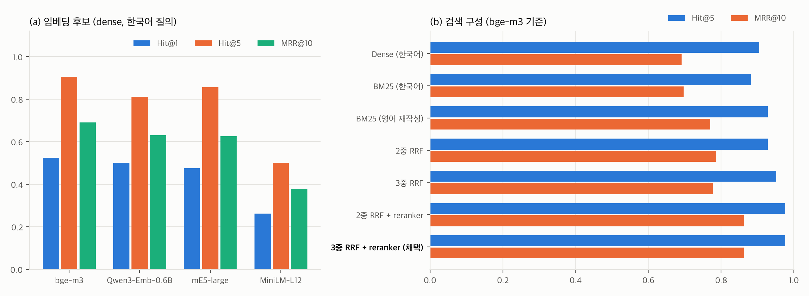
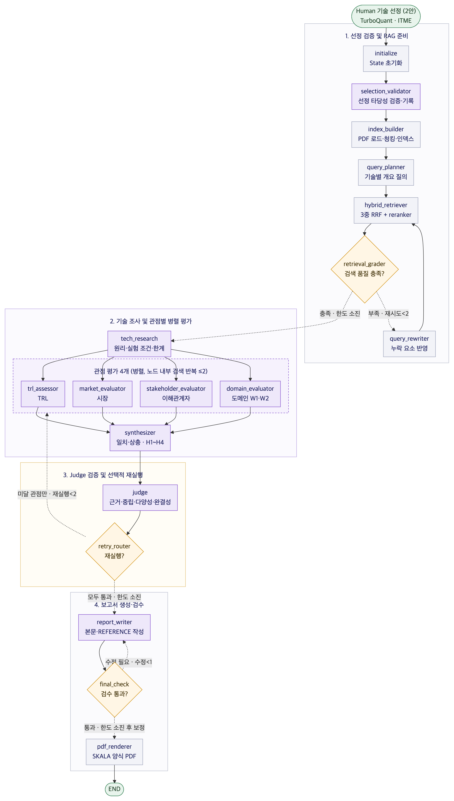

# 요약

- 데이터센터·클라우드 장문맥 LLM 서빙을 도메인으로 정하고, KV cache 병목을 SW로 푸는 Google TurboQuant와 HW로 푸는 SK hynix ITME가 TRL·시장·이해관계자·도메인 관점에서 어떻게 평가되는지 비교하는 Agentic RAG를 설계했다. 두 기술의 우열은 판정하지 않는다.
- 기술은 조가 직접 골랐다(2안). 후보 6개를 같은 기준표로 채점했고, 에이전트는 선정 결과를 원문으로 검증해 기록만 한다.
- RAG는 Doc Pool 논문 6편(136쪽)을 대상으로 한다. 임베딩은 한국어 질의로 영어 논문을 찾는 42문항 평가를 직접 만들어 후보 4종을 비교한 뒤 bge-m3로 정했다. 검색은 3중 하이브리드와 reranker를 쓰며 Hit@5 0.976, MRR 0.863이다.
- 그래프는 에이전트 7개(가이드 6개와 Judge), 노드 18개, State 키 27개로 구성한다. 루프 4개에는 모두 횟수 한도가 있고, Judge가 기준에 못 미친다고 본 관점만 다시 실행한다.
- 관점별 채점 기준(Rubric)을 미리 정해 두고, 찬반 근거를 함께 찾게 하며, 한 출처 계열이 근거의 절반을 넘지 못하게 해 확증편향을 줄인다.

---pagebreak---

# A. 대상 기술 선정

## A.1 분석 배경

LLM은 토큰을 하나씩 생성하면서 앞에서 계산한 Key·Value 값을 KV cache에 저장해 두고 다시 쓴다. 재계산은 줄지만 KV cache의 크기가 문맥 길이와 동시 요청 수에 비례해 커지므로, 병목이 연산에서 메모리(HBM)로 옮겨 간다.

Llama-3.1-8B(레이어 32, KV 헤드 8, 헤드 차원 128, FP16)를 예로 들면 토큰 하나에 128 KiB가 필요하다. 128K 토큰 요청 한 건이면 16 GiB로 모델 가중치(약 16 GB)와 비슷한 크기가 된다. 80 GB GPU 한 장에서 가중치를 빼면 64 GB가 남으므로 128K 세션은 3개만 온전히 유지할 수 있고, 활성값까지 고려하면 더 적다.

이 문제를 푸는 방법은 두 갈래이다. SW 진영은 KV를 작게 만들고(양자화·압축, 어텐션 구조 변경), HW 진영은 KV를 둘 공간을 넓힌다(HBM 밖의 호스트 메모리·CXL·스토리지로 확장). 둘은 대립하는 것처럼 보이지만 함께 쓰이는 경우가 많다. 압축한 KV는 하위 메모리 계층으로 옮기기도 쉽다.

## A.2 선정 기준

Doc Pool의 후보 6개를 네 가지 기준에 따라 5점 척도로 채점하고 가중합을 구한다. 가중합과 별도로 제외 조건에 하나라도 해당하면 후보에서 뺀다.

<!--w:2.6,1.6,11.8-->
| 기준 | 가중치 | 판단 질문 |
|---|---|---|
| 비교 공정성 | 35% | 두 기술 모두 모델 학습이 끝난 뒤 같은 시점(추론·서빙 단계)에서 KV cache 용량 문제를 다루는가 |
| 근거 확보성 | 25% | 원 논문 외에 독립적인 자료를 구할 수 있고, 장점과 한계를 함께 확인할 수 있는가 |
| 산업 연관성 | 25% | GPU 서빙 생태계나 CXL 메모리 생태계와 이어져 있어 도입 주체와 이해관계자를 특정할 수 있는가 |
| 최신성 | 15% | 장문맥·에이전트 워크로드의 최근 문제와 관련이 있는가 |

제외 조건은 네 가지이다. KV cache를 직접 다루지 않는 경우, 원문을 구할 수 없는 경우, 적용 시점이 크게 다른 경우(예: 사전학습 단계), 성능 수치의 실험 환경과 기준선이 공개되지 않은 경우이다.

## A.3 후보 평가표

<!--w:2.3,1.0,1.3,1.3,1.3,1.1,1.2,6.5-->
| 후보 | 진영 | 공정성 | 근거 | 산업 | 최신 | 가중합 | 채점 이유 |
|---|---|---|---|---|---|---|---|
| **TurboQuant** | SW | 5 | 3 | 5 | 4 | **4.35** | 재학습 없이 서빙 중 KV를 양자화한다. 확보한 자료가 논문(2025-04)과 공식 블로그(2026-03-24)로 모두 Google 자료라 ITME와 같은 기준으로 근거 3점을 줬다 |
| KIVI | SW | 5 | 4 | 3 | 2 | 3.80 | 서빙 단계 2bit 양자화(ICML 2024). TurboQuant 논문이 직접 비교한 기준선이라 비교 자료로 쓴다 |
| DeepSeek MLA | SW | 1 | 5 | 4 | 2 | 2.90 | 어텐션 구조를 바꾸므로 사전학습이 필요해 제외 조건에 해당한다. 대조 자료로만 쓴다 |
| **ITME** | HW | 5 | 3 | 5 | 5 | **4.50** | vLLM v0.17.0 위에 구현했고 모델을 바꾸지 않는다. 양산급 CMM과 FPGA로 실측했다(2026-06). 1차 자료가 SK hynix 단일 출처라 근거 3점 |
| InfiniGen | HW | 4 | 3 | 2 | 2 | 2.95 | 호스트 메모리 오프로딩과 선택적 프리패치(OSDI 2024). 오프라인 가중치 변환이 필요해 공정성 4점 |
| CXL-PNM | HW | 3 | 2 | 3 | 4 | 2.90 | CXL 메모리 안에 연산기를 두어 실행 위치를 바꾼다. 새 연산 HW가 필요하고 시뮬레이션 중심의 preprint이다(2025-10) |

진영별 최고점은 SW가 TurboQuant(4.35), HW가 ITME(4.50)이다. KIVI, InfiniGen, CXL-PNM은 보고서에서 기준선과 대안 기술로 인용한다.

## A.4 선정 결과와 사유

두 기술을 비교할 수 있는 이유는 같은 종류의 기술이어서가 아니다. 같은 KV cache 용량 문제를, 같은 서빙 시점에서, 서로 다른 계층에서 푼다. TurboQuant는 데이터 표현(비트 수)을 바꾸고 ITME는 저장 위치(메모리 계층)를 바꾼다.

<!--w:3.0,6.5,6.5-->
| 사유 | TurboQuant (Google) | ITME (SK hynix, CXL-hybrid 계층 메모리) |
|---|---|---|
| 같은 틀로 평가 가능 | 재학습 없이 서빙 단계에서 KV를 양자화하므로 모델을 바꾸지 않는다 | vLLM 위의 서빙 계층 기술이고 모델을 바꾸지 않는다 |
| 접근 방식 | 3.5bit/채널에서 품질 변화가 없고 2.5bit에서 소폭 떨어진다고 보고했다(LongBench·NIAH) | KV를 양자화하지 않고 CXL-hybrid 메모리로 TB 단위까지 넓힌다. NVMe-oF 대비 처리량 1.80배, CPU 오프로드 대비 최대 35.7% 향상을 보고했다 |
| 관점별로 갈릴 지점 | 추가 HW 없이 메모리를 줄인다는 기대와, 정확도 영향과 서빙 엔진 통합 수준에 대한 우려가 함께 있다 | 손실 없는 용량 확장이라는 기대와, 원격 계층 지연·인프라 비용·배포 성숙도라는 제약이 함께 있다 |
| 이해관계자 | 서빙 엔진 개발자, 클라우드 사업자, 다른 KV 압축 진영(KIVI, NVIDIA KVTC 등) | 메모리 벤더, 서버·클라우드 사업자, CXL Consortium, NVMe 기반 대안 진영(NVIDIA CMX 등). TurboQuant와 거의 겹치지 않는다 |
| TRL 관찰 | 논문과 오픈소스 구현 중심이라 연구가 실제 도입으로 넘어가는 과정을 볼 수 있다 | 양산급 모듈로 실측했지만 상용 배포 정보가 적어 TRL 4~6 구간의 공개 정보 부족을 볼 수 있다 |
| 최신성 | 2026년 3월 블로그 공개 이후 시장·언론 반응이 많다 | 2026년 6월 공개, 국내 CXL 메모리 생태계와 직접 연결된다 |

## A.5 원 논문의 핵심 기여

아래 내용은 원 논문의 해당 쪽에서 확인했다(쪽 번호는 arXiv PDF 기준).

**TurboQuant (arXiv 2504.19874)**

<!--w:3.1,3.8,3.0,3.3,2.8-->
| 기존 방식의 문제 | 핵심 기여 | 개선되는 점 | 남는 제약 | 관련 평가 항목 |
|---|---|---|---|---|
| 기존 벡터 양자화는 최적 왜곡률에 못 미친다(p.1) | 무작위 회전으로 좌표 분포를 맞춘 뒤 좌표별로 최적 양자화를 한다(TurboQuant_mse, p.1·5·10) | 이론 하한의 약 2.7배 이내 왜곡률(p.1) | 회전·양자화 연산이 서빙 경로에 더해진다. 서빙 엔진 통합과 처리량은 논문에서 다루지 않는다 | 도메인(통합·지연), TRL |
| MSE 기준 양자화는 내적 추정을 치우치게 만드는데, 어텐션 점수가 내적이다(p.1) | 잔차에 1bit QJL을 더해 치우침 없는 내적 양자화기를 만든다(TurboQuant_prod, p.1·12) | 어텐션 점수 추정의 치우침을 줄인다 | 부호 비트와 노름을 추가로 저장해야 한다 | 도메인(정확도) |
| 캘리브레이션이 필요한 양자화는 계속 생성되는 KV에 쓰기 어렵다. TurboQuant 논문은 KIVI 등이 생성 토큰을 양자화하지 않는다고 적었다(p.18). 반면 KIVI 논문은 최근 일부 토큰만 원래 정밀도로 두고 나머지는 묶어서 양자화한다고 설명한다(KIVI p.5) | 데이터에 의존하지 않는 온라인 방식이라 생성 중인 토큰에도 적용한다(p.1·18) | 캘리브레이션 없이 긴 생성에도 쓸 수 있다 | 2.5bit에서 품질이 조금 떨어진다(p.1). 실험은 A100 한 장과 8B급 모델로 했다(p.15) | 도메인(정확도), 시장(발표 내용과 실험 조건 대조) |

Google 블로그는 KV 메모리를 6배 이상 줄이고 속도는 최대 8배라고 소개했다. 이 8배는 H100에서 4bit 키와 32bit 키의 어텐션 점수 계산 속도를 비교한 값이라 기준선을 함께 봐야 한다.

**ITME (arXiv 2606.12556)**

<!--w:3.1,3.8,3.0,3.3,2.8-->
| 기존 방식의 문제 | 핵심 기여 | 개선되는 점 | 남는 제약 | 관련 평가 항목 |
|---|---|---|---|---|
| DPU 기반 JBOF로 NVMe-oF를 처리해도 SW 부담과 비용 문제가 남고, 호스트 메모리는 CPU 소켓·채널 수에 묶인다(p.1) | NAND와 DRAM 캐시를 합친 CXL-hybrid 메모리를 CPU 없는 NUMA 노드로 붙여 TB급 원격 메모리를 바이트 단위로 쓴다(p.1·4). 저가 RNIC로 DPU 없이 구성한다(p.3) | SW 스택이 단순해지고 호스트 한계를 넘는 KV 용량을 확보한다(p.1) | 로컬 GPU 메모리보다 지연이 크고(p.9) NAND 수명 관리가 필요하며(p.5) 전용 CXL 장치와 RNIC가 있어야 한다 | 도메인(지연·비용·통합), 시장(CXL 생태계) |
| 필요할 때 원격에서 가져오면 전송 지연이 그대로 드러난다 | 모델 가중치와 prefix KV의 접근 순서를 미리 알 수 있다는 점을 이용해 여러 계층에 걸쳐 미리 옮겨 둔다(p.1·3) | 전송 지연을 가리고 재계산보다 유리하다(p.9) | 접근을 예측하기 어려운 KV는 대상이 아니며, 없으면 GPU에서 다시 계산한다(p.7) | 도메인(W2 조건) |
| 검증 방식 | 양산급 CMM과 PCIe Gen5 NVMe로 성능을 평가하고 FPGA 시제품으로 기능을 확인했다. vLLM v0.17.0 위에 구현했다(p.1·9) | 시뮬레이션이 아닌 실제 HW로 측정했다 | 저자와 제품이 모두 SK hynix이다. 워크로드는 ShareGPT 다중 턴, Llama-3.1 8B/70B이다(p.9) | TRL, 이해관계자 |

## A.6 알려진 약점과 선정 검증

ITME는 저자 전원이 SK hynix 소속이고 자사 제품으로 측정했다. 시장·이해관계자 관점에서는 제3자 자료를 따로 찾아야 한다. TurboQuant는 논문 실험이 품질과 왜곡률 위주이고 서빙 엔진 통합과 처리량 수치는 없다.

평가하는 우리 조가 SK 교육과정 소속이고 ITME는 SK hynix 기술이다. 그래서 두 기술에 같은 기준을 쓰고, 이 점을 보고서 한계에 적는다.

선정은 사람이 했으므로 기술 조사 에이전트의 `selection_validator`가 원문을 보고 세 가지를 다시 확인한다. 같은 문제를 다루는지, 적용 시점이 같은지, 공개 근거가 충분한지이다. 충족하지 못한 항목이 있으면 사유와 대체 후보를 기록하고 실행은 계속한다. 선정을 바꾸는 일은 팀이 실행 밖에서 결정하고 `--tech` 옵션으로 다시 돌린다. 검증 결과는 보고서 2.4절에 싣는다.

# B. 설계

## B.1 기술 선정 방식

가이드의 두 방식 중 조가 직접 고르는 2안을 택했다. 에이전트가 검색 결과만으로 대상을 정하면 최근 자료에 치우치거나 비교 대상의 계층이 어긋날 수 있다. 에이전트는 사람이 고른 기술을 다시 고르지 않고 근거로 검증만 한다. 그래서 그래프에는 에이전트 선정이나 재선정 분기가 없다. 선정 기술은 `config.yaml`에 적고 `--tech sw=turboquant,hw=itme`로 바꿀 수 있다.

## B.2 RAG 적용 대상

<!--w:3.0,1.3,5.2,6.5-->
| 에이전트 | RAG | 검색 대상 | 결과물 |
|---|---|---|---|
| 기술 조사 (검증·개요·TRL) | O | 선정 기술 원 논문과 기준선·대안 논문 | 작동 원리, 실험 조건, 한계, TRL 근거 |
| 시장 평가 | O + 웹 | 논문은 발표 내용의 성능 수치를 원래 실험 조건과 대조하는 데만 쓴다. 나머지는 제품·표준·프레임워크 웹 자료 | 시장성, 채택 사례, 생태계 지원의 찬반 근거 |
| 이해관계자 평가 | 웹 | 기업 발표, 개발자 문서·토론, 산업 분석, 언론 | 경쟁 진영, 도입 기업, 개발자, 투자 업계의 시각 |
| 도메인 평가 | O + 웹 | 논문의 실험 환경·워크로드와 실제 시스템 자료 | 데이터센터 장문맥 서빙(W1·W2)에서의 적합 조건과 제약 |
| 평가 종합, Judge, 보고서 | X | 앞 단계에서 정리한 결과와 근거 ID만 쓴다 | 상충 매트릭스, 품질 판정, 보고서 |

이해관계자 관점은 최근 반응이 중요해 논문 검색의 이점이 작으므로 웹만 쓴다. 평가 종합, Judge, 보고서 에이전트는 새로 검색하지 않는다. 근거 없는 내용이 들어올 수 있는 곳을 관점 에이전트로 한정하기 위해서다.

## B.3 RAG 대상 문서 (200쪽 한도)

Doc Pool 6편을 모두 넣었다. 선정 기술 논문 두 편만 넣으면 기준선이나 대안과 비교할 근거가 없기 때문이다. 문서마다 역할(1차 근거, 기준선, 대안)을 붙이고, 에이전트는 기술과 역할로 걸러서 검색한다.

<!--w:2.4,2.2,1.2,1.3,1.9,1.2,5.8-->
| 논문 | arXiv | 쪽수 | 진영 | 역할 | 청크 | 쓰임 |
|---|---|---|---|---|---|---|
| TurboQuant | 2504.19874 | 25 | SW | 1차 근거 | 21 | 선정 기술 |
| DeepSeek-V2 (MLA) | 2405.04434 | 52 | SW | 대안 | 44 | 구조 변경 방식과의 대조 |
| KIVI | 2402.02750 | 15 | SW | 기준선 | 21 | 양자화 기준선 |
| InfiniGen | 2406.19707 | 18 | HW | 대안 | 26 | 호스트 오프로딩 방식 |
| ITME | 2606.12556 | 13 | HW | 1차 근거 | 24 | 선정 기술 |
| CXL-PNM | 2511.00321 | 13 | HW | 대안 | 23 | CXL 메모리 내 연산 방식 |
| **합계** | | **136** | | | **159** | 한도 200쪽의 68% |

## B.4 문서 처리와 인덱싱

1. PyMuPDF로 읽으면서 글꼴 크기와 굵기로 절 제목을 찾아 청크마다 절 이름을 붙인다. 머리글·바닥글·쪽번호·arXiv 표시는 지우고, 참고문헌은 빼고 부록은 남긴다.
2. 절 경계를 지키면서 900토큰(cl100k 기준) 단위로 자르고 15%를 겹친다. 결과는 청크 159개이다. 같은 청크를 임베딩 모델 토크나이저로 세면 평균 약 750, 최대 1,529토큰이라 bge-m3의 입력 길이는 2,048로 둔다.
3. 청크마다 문서 ID, 기술, 진영, 역할, 제목, 절, 쪽, 공개일을 저장한다.
4. 청크 앞에 "제목 | 절"을 붙여 임베딩하고 FAISS에 넣으며 BM25 인덱스도 함께 만든다. 문서가 바뀌지 않았으면 기존 인덱스를 다시 쓴다.

## B.5 검색 방식

1. 공통 검색의 `query_planner`는 기술마다 원리·실험 조건·한계를 묻는 질의를 만든다. 관점 에이전트는 기술, 관점, 입장(지지·반대), 확인할 지표를 조합해 자기 질의를 만들고, 반대 근거는 따로 찾는다. 예를 들면 "TurboQuant 장문맥 정확도 저하를 지적하는 결과" 같은 질의이다.
2. 한국어 질의를 영어 검색어로 바꿔 쓴다. 이때 질문만 보고 바꾸므로 정답 내용이 섞이지 않는다.
3. 한국어 dense, 영어 dense, 영어 BM25 세 순위를 RRF(k=60)로 합치고, bge-reranker-v2-m3로 상위 20개를 다시 정렬해 5개를 넘긴다.
4. 공통 검색 결과에 기술명, 원리, 수치나 한계가 빠졌으면 `query_rewriter`가 빠진 요소를 넣어 다시 검색한다. 최대 2번까지 하고, 그래도 부족하면 경고를 남긴다.
5. 보고서의 모든 주장에는 근거 ID를 하나 이상 붙인다.

## B.6 임베딩 모델 선정

리더보드 순위 대신, 이 과제의 실제 조건인 "한국어 질의로 영어 논문 청크 찾기"를 직접 측정해서 골랐다. 후보는 다국어를 지원하는 오픈소스 4종으로 bge-m3, multilingual-e5-large, Qwen3-Embedding-0.6B, paraphrase-multilingual-MiniLM-L12(경량 기준선)이다.

고르는 순서는 세 단계이다. 먼저 필수 조건으로 거른다. 다국어 검색, 로컬 실행, 오픈소스 라이선스, 그리고 모델의 최대 입력이 가장 긴 청크(1,529토큰)보다 길어야 한다. 이 조건을 통과한 모델은 bge-m3와 Qwen3뿐이다. e5와 MiniLM은 비교용으로 측정만 했다. 다음으로 평가셋으로 정확도를 재고, 마지막으로 SW·HW 문서 사이의 균형과 운영 비용을 본다.

평가셋은 논문마다 청크 10개를 골라 gpt-4.1로 한국어 질문 60개를 만든 데서 시작했다. 자동 점검에서 57개가 남았고, 여러 모델의 상위 결과를 모아 정답 청크를 다시 판정했다. 정답이 너무 많은 포괄적 질문을 빼고 논문별 7문항씩 골라 42문항(SW 21, HW 21)으로 정했다. 42문항 중 11문항(26%)은 사람이 원문과 대조해 확인했다. 모든 모델에 같은 청크와 질문을 쓰고, 모델마다 모델 카드가 권하는 질의 설정을 썼다.

표의 "평가"는 처음 측정한 조건(bge-m3·Qwen3 입력 길이 1,024)이다. 이때 긴 청크 일부가 잘렸다(bge-m3 17개, Qwen3 4개). "구현"은 실제로 쓸 조건(2,048, 잘림 없음)에서 다시 잰 값이다. 구현 조건의 값은 새로 순위에 오른 청크 중 정답 판정을 하지 않은 것을 오답으로 처리했으므로 실제보다 낮을 수 있다.

**표 B.6-1. 임베딩 후보 (dense, 한국어 질의)**

<!--w:3.1,1.6,1.4,1.2,1.2,2.4,2.3,1.3,1.5-->
| 모델 | 모델 최대 입력 | 필수 조건 | Hit@1 | Hit@5 | MRR@10 평가→구현 | SW / HW MRR | 질의(ms) | 메모리(MB) |
|---|---|---|---|---|---|---|---|---|
| bge-m3 | 8,192 | 통과 | 0.524 | 0.905 | 0.703 → 0.691 | 0.748 / 0.635 | 7.2 | 3049 |
| qwen3-embedding-0.6b | 32,768 | 통과 | 0.500 | 0.810 | 0.631 → 0.631 | 0.770 / 0.493 | 10.1 | 3265 |
| multilingual-e5-large | 512 | 미달 | 0.476 | 0.857 | 0.626 → 0.626 | 0.662 / 0.589 | 7.7 | 3081 |
| multilingual-minilm-l12 | 128 | 미달 | 0.262 | 0.500 | 0.377 → 0.377 | 0.378 / 0.375 | 1.0 | 1065 |

**표 B.6-2. 검색 구성 (bge-m3 기준)**

<!--w:6.1,1.65,1.65,1.65,1.65,1.65,1.65-->
| 검색 구성 | 평가 Hit@1 | 평가 Hit@5 | 평가 MRR | 구현 Hit@1 | 구현 Hit@5 | 구현 MRR |
|---|---|---|---|---|---|---|
| Dense (한국어 질의) | 0.548 | 0.905 | 0.703 | 0.524 | 0.905 | 0.691 |
| BM25 (한국어 질의) | 0.548 | 0.881 | 0.697 | 0.548 | 0.881 | 0.697 |
| BM25 (영어 재작성 질의) | 0.643 | 0.929 | 0.770 | 0.643 | 0.929 | 0.770 |
| 2중 RRF: Dense(KO) + BM25(EN) | 0.643 | 0.929 | 0.786 | 0.643 | 0.929 | 0.786 |
| 3중 RRF: Dense(KO) + Dense(EN) + BM25(EN) | 0.667 | 0.952 | 0.790 | 0.643 | 0.952 | 0.778 |
| 2중 RRF + reranker | 0.786 | 0.976 | 0.863 | 0.786 | 0.976 | 0.863 |
| **3중 RRF + reranker (채택)** | 0.786 | 0.976 | 0.863 | 0.786 | 0.976 | 0.863 |

<!--img:15.8-->

두 측정 조건 모두에서 bge-m3가 Hit@1, Hit@5, MRR이 가장 높았다. Qwen3는 SW 질문의 MRR이 bge-m3와 비슷하거나 조금 높았지만(0.770 대 0.748) HW 질문에서 0.493으로 떨어졌다. 두 진영 문서를 같은 비중으로 찾아야 하는 과제라서, 약한 쪽의 성능을 보는 min(SW, HW) 기준에서 bge-m3(0.635~0.659)가 Qwen3(0.493)보다 높은 점도 확인했다. 설계 초안에서는 Qwen3를 가정했지만 이 결과에 따라 bge-m3로 바꿨다.

검색 구성은 3중 RRF에 reranker를 붙인 구성을 쓴다. reranker를 붙이면 MRR이 0.07~0.09 오르고, 질의당 4.5~4.7초가 더 든다. 보고서 생성은 대화형이 아닌 일괄 작업이라 이 시간을 감수한다. 필요하면 `--no-rerank`로 끌 수 있다. reranker를 붙인 뒤에는 2중과 3중의 값이 같다. 3중 구성은 reranker 전 첫 측정(MRR 0.790 대 0.786)으로 먼저 정한 것이라, 결과를 본 뒤 바꾸지 않고 유지했다.

이 평가의 한계도 있다. 설정 선택과 성능 보고를 같은 42문항으로 해서 과적합 가능성이 있고, 1문항이 약 2.4%p에 해당한다. SW·HW 균형 기준은 측정한 뒤에 정했다.

## B.7 도구 정의

<!--w:4.2,3.6,8.2-->
| 도구 | 쓰는 에이전트 | 동작 |
|---|---|---|
| `paper_retrieve(query, camp, tech, role, k)` | 기술 조사, 시장, 도메인 | B.5의 하이브리드 검색. 진영·기술·역할로 걸러 찾고 근거 ID(P:청크 ID), 쪽, 절을 돌려준다 |
| `web_search(query, days, stance)` | TRL, 시장, 이해관계자, 도메인 | Tavily 검색. 결과를 날짜와 함께 저장해 두고 `--offline`이면 저장본만 쓴다. URL, 게시일, 발행 주체, 벤더·제3자 구분이 붙은 근거 ID(W:해시)를 돌려준다 |
| `summarize_sources(docs, focus)` | 관점 에이전트 | 근거 묶음을 주제별로 요약한다. 원래 근거 ID를 그대로 유지하고, 근거 없는 문장은 만들지 않는다 |

## B.8 LLM 구성과 재현성

<!--w:3.2,12.8-->
| 항목 | 설정 |
|---|---|
| 생성 모델 | gpt-4.1-mini, temperature 0, seed 42 |
| Judge 모델 | gpt-4.1. 생성 모델보다 상위 모델로 채점하지만 같은 계열이라 자기 평가 편향을 줄이는 효과는 제한적이다 |
| 캐시 | LLM 응답과 웹 검색 결과를 저장소에 올려 두어 `--offline`이면 API 키 없이 같은 보고서를 다시 만든다 |
| 추적 | LangSmith, 실행 로그, State의 `audit_log` |

# C. 평가 관점 및 기준

## C.1 도메인 선정과 문제 정의

<!--w:4.2,9.2,2.6-->
| 도메인 후보 | 검토 | 결과 |
|---|---|---|
| 데이터센터·클라우드 장문맥 LLM 서빙 | 두 기술 모두 장문맥·대규모 요청에서 KV cache가 커지는 문제를 다룬다. 논문 실험 환경(GPU 서버, CXL 서버와 vLLM)과 맞고, 관련 산업(vLLM, CXL 표준)도 여기에 모여 있다 | **선정** |
| 온디바이스·엣지 추론 | 전력·메모리 제약이 커서 평가 기준 자체가 달라지고, 두 기술 모두 직접 근거가 적다 | 제외 |
| 멀티모달 서빙 | 두 논문 모두 텍스트 실험만 있다 | 제외 |

도메인은 데이터센터·클라우드 장문맥 LLM 서빙 하나로 정했다. 도메인 적합성을 채점할 때는 이 도메인 안의 대표 워크로드 두 가지를 나눠 본다. W1은 긴 문서 QA·요약처럼 요청 하나가 긴 문맥(32K~128K 토큰 이상)을 갖는 장문맥 배치 추론이다. W2는 챗봇·에이전트처럼 여러 사용자가 대화를 이어가며 앞 대화의 KV를 다시 쓰는 고동시성 다중 턴 서빙이다. TurboQuant 논문의 실험은 W1에, ITME 논문의 실험은 W2에 가까워서 둘을 나눠야 조건 차이가 드러난다. W1·W2는 도메인 적합성 채점에만 쓰고 시장·이해관계자 조사 범위는 늘리지 않는다.

<!--w:3.2,12.8-->
| 구분 | 내용 |
|---|---|
| 상황 | 장문맥과 다중 턴·에이전트 워크로드가 늘면서 서빙 사업자는 GPU당 동시 세션 수와 최대 문맥 길이가 HBM 용량에 묶이는 문제를 겪는다. GPU를 늘리는 것 외에 KV를 줄이는 SW 기술과 KV 공간을 늘리는 HW 기술이 대안으로 나온다 |
| 문제 | 같은 기술이라도 시장, 이해관계자, 도메인 관점에서 평가가 엇갈린다. 시장은 바로 적용할 수 있다는 점을 높게 보고, 도메인 쪽은 정확도와 엔진 통합을 문제 삼는 식이다. 이를 근거 없이 한쪽으로 요약하면 판단이 왜곡된다 |
| 분석 질문 | Q1. 두 기술은 관점마다 어떤 근거로 어떻게 평가되는가<br>Q2. 관점끼리 어디서 일치하고 어디서 엇갈리며, 그 이유는 무엇인가<br>Q3. 워크로드(W1, W2)와 함께 쓰는 경우에 따라 평가 조건이 어떻게 달라지는가 |
| 결과물 | 기술 추천이나 우열 판정이 아니라, 관점별 평가 차이와 그 근거·조건을 따라갈 수 있게 정리한 보고서 |
| 독자 | LLM 인프라 기획·운영 담당자, 메모리 반도체 사업 기획 담당자 |

벤치마크 재현 실험, 기술 간 우열·추천, 가격 추정은 범위에서 뺀다.

## C.2 공통 원칙

이 평가는 어느 기술이 나은지 판정하지 않고, 같은 기술이 관점에 따라 어떻게 다르게 평가되는지를 보여 준다.

<!--w:2.8,13.2-->
| 원칙 | 적용 방법 |
|---|---|
| 찬반 균형 | 관점마다 기술별로 장점 근거와 한계 근거를 각각 2건 이상 찾고, 한쪽만 있으면 다시 검색한다. 근거에는 해당 기술 고유의 내용인지, 기술 범주 일반(예: CXL 전반에 대한 비판)인지 표시하며, 범주 일반 근거로는 이 할당을 채울 수 없다. 끝내 부족하면 억지로 균형을 맞추지 않고 "근거 부족"으로 둔다 |
| 출처 다양성 | 한 출처 계열이 해당 관점·기술의 웹 근거에서 50%를 넘지 않게 한다. 주소는 등록 도메인으로 묶고, 같은 회사의 여러 사이트는 한 계열로 본다(예: research.google, blog.google). 같은 보도자료를 옮겨 쓴 기사는 도메인이 달라도 같은 계열이다. 모든 웹 근거에 벤더·제3자 구분을 붙인다 |
| 개발사 발언 | 평가 대상 기술을 만든 회사(TurboQuant는 Google, ITME는 SK hynix)의 발언과 보도자료는 이해관계자 점수에 넣지 않고 참고로만 인용한다 |
| 근거 추적 | 모든 수치와 판단에 논문 쪽 번호나 URL을 붙인다. 근거 없는 문장은 Judge가 표시하고 보고서에서 뺀다 |
| 대칭 | 두 기술에 같은 평가 항목, 질문 틀, 검색 횟수 한도를 쓴다 |
| 표현 | "우수하다", "열등하다", "더 낫다" 같은 표현을 찾아 "어떤 조건에서 어떤 결과가 보고됐다"는 식으로 고친다 |

## C.3 관점별 평가 대상과 기준

<!--w:2.2,3.3,4.6,2.9,3.0-->
| 관점 (담당) | 평가 대상 | 평가 기준 | 근거 유형 | 결과 (State) |
|---|---|---|---|---|
| 기술 성숙도 TRL (기술 조사) | 원 논문, 공개 구현, 제품화 소식 | 검증 수준(시뮬레이션, 실제 HW 측정, 시제품), 코드·데이터 공개, 서빙 프레임워크 반영, 샘플 공급·제품 출시 | 논문(실험 조건), 웹(출시·발표) | `trl_result`: 기술별 TRL 범위, 근거표, 신뢰도 |
| 시장성 (시장 평가) | TurboQuant는 추론 서빙 최적화 SW 시장, ITME는 CXL 메모리 확장 HW 시장 | 시장 규모·성장, 상용화·채택 사례, 생태계 지원(vLLM·TensorRT-LLM·SGLang, CXL Consortium·OCP), 도입 비용 구조 | 시장 보고서, 제품 발표, 프레임워크 문서, 논문(적용 조건) | `market_result`: 기준별 찬반 근거와 점수 |
| 이해관계자 (이해관계자 평가) | (a) 클라우드·데이터센터 사업자 (b) GPU·메모리 벤더(개발사 제외) (c) 개발자 커뮤니티 (d) 투자·분석·언론 | 공식 입장, 커뮤니티 반응, 대응 기술, 채택 장벽, 투자·표준화 참여 | 웹(기업 발표, 개발자 토론, 언론·분석) | `stakeholder_result`: 집단별 입장(지지·중립·우려)과 근거 |
| 도메인 적합성 (도메인 평가) | 데이터센터 장문맥 서빙의 W1, W2 | 비용 구조, 지연(TTFT·TPOT), 처리량·동시성, 정확도 영향, 통합 난이도(엔진·드라이버·HW 변경) | 논문(벤치마크 조건), 웹(실제 시스템 사례) | `domain_result`: 워크로드별 적합 조건·제약 |

## C.4 TRL 추정 규칙

<!--w:1.4,6.6,8.0-->
| TRL | 단계 | KV cache 기술에서 인정하는 공개 근거 |
|---|---|---|
| 1–3 | 원리 관찰, 개념 정립, 실험실 검증 | 이론 분석, 시뮬레이션, GPU 한 장과 공개 모델로 한 실험 |
| 4 | 실험실 환경 부품 검증 | 실제 GPU·CXL 모듈에서 구성요소를 합쳐 실험 |
| 5 | 유사 환경 통합 검증 | 실제 서빙 엔진(vLLM 등)과 실제 규모 워크로드로 검증 |
| 6 | 실제와 비슷한 조건의 시스템 시연 | 시제품 시연, 공개 데모, 파트너 평가 |
| 7 | 실제 운용 환경 시제품 시연 | 고객사 시범 적용, 샘플 공급, 실서비스 시험 |
| 8 | 시스템 완성, 양산 적합성 | 정식 제품 출시, 주요 프레임워크 정식 기능 탑재 |
| 9 | 실제 운용, 상용 납품 | 상용 서비스 운영 사례, 양산 납품·실적 공시 |

TRL 1~3은 논문과 학회로 대부분 공개되고, 7~9는 샘플·양산 발표로 일부 공개된다. 4~6은 수율과 실측치가 영업 비밀이라 공개 정보가 가장 적고, KV cache 기술은 논문과 실제 채택 사이에 시차도 있다. 그래서 TRL은 공개 정보로 추정한 값임을 밝히고, 한 숫자가 아니라 범위(예: 4–5)와 신뢰도로 적는다. 범위의 하한은 공개 근거로 확인된 가장 높은 단계, 상한은 발표나 계획 같은 부분 신호로 보이는 단계이다. 하한과 상한 모두 독립 근거가 있으면 신뢰도 높음, 한쪽만 있으면 보통, 개발사 자료뿐이면 낮음이다.

## C.5 점수 규칙과 상충 판정

기준마다 1점(부정적 평가가 많음)부터 5점(긍정적 평가가 많음)까지 인식 점수를 주고, 이유와 근거 ID를 함께 적는다. 기준별 가중치는 분석 전에 아래처럼 고정한다. 근거 개수는 가중치에 쓰지 않는다. 웹 자료가 많은 기술이 유리해지지 않게 하기 위해서다. 근거가 부족한 기준은 낮은 점수 대신 "판단 보류"로 두고 계산에서 빼며, 빠진 가중치가 50%를 넘으면 그 관점 전체를 판단 보류로 한다.

<!--w:2.4,7.6,6.0-->
| 관점 | 기준과 고정 가중치 | 점수 계산 |
|---|---|---|
| 시장성 | 시장 규모·성장 25, 상용화·채택 30, 생태계 지원 30, 도입 비용 구조 15 | 기준 점수의 가중 평균 |
| 이해관계자 | (a) 클라우드·데이터센터 25, (b) GPU·메모리 벤더 25, (c) 개발자 25, (d) 투자·언론 25 | 집단별 입장을 지지 5, 중립·혼재 3, 우려 1로 바꿔 가중 평균 |
| 도메인 적합성 | W1 50, W2 50. 워크로드마다 비용·지연·처리량·정확도·통합 난이도 각 20 | 워크로드별 가중 평균. W1과 W2의 차이는 H3 판정에도 쓴다 |
| TRL | 점수를 매기지 않고 범위와 신뢰도로 적는다 | 상충 판정에는 넣지 않고 H1 판정에만 쓴다 |

상충 판정은 점수가 있는 세 관점(시장, 이해관계자, 도메인) 사이에서 기술별로 한다. 같은 기술의 두 관점 점수 차이가 2.0 이상이면 상충, 1.0 이상 2.0 미만이면 부분 상충, 1.0 미만이면 일치이다. 판단 보류인 관점은 뺀다. 두 기술을 합치거나 순위를 매기지는 않는다. 2.0과 1.0은 절대 기준이 아니라 분류를 일관되게 하려고 미리 정한 값이므로, 보고서에서 이 값을 0.5씩 바꿨을 때 결과가 달라지는 칸 수도 함께 보고한다.

TRL은 성숙도 척도라 인식 점수와 섞지 않는다. H1은 아래 격자로 판정한다. TRL은 범위의 가운데 값(예: 4–5면 4.5)으로 구간을 정한다. 대각선은 일치, 한 칸 어긋나면 부분 괴리, 두 칸 어긋나면 괴리이다. 시장 평가가 성숙도보다 앞서면 "기대 선행", 뒤처지면 "채택 신호 지연"으로 적는다. 어느 기술이 어느 쪽에 해당할지는 미리 정하지 않는다.

<!--w:3.6,4.1,4.1,4.2-->
| TRL 구간 | 시장 2.0 이하 | 시장 2.0 초과 4.0 미만 | 시장 4.0 이상 |
|---|---|---|---|
| 초기 (3.5 이하) | 일치 | 부분 괴리 (기대 선행) | 괴리 (기대 선행) |
| 중간 (3.5 초과 6.5 미만) | 부분 괴리 (채택 신호 지연) | 일치 | 부분 괴리 (기대 선행) |
| 후기 (6.5 이상) | 괴리 (채택 신호 지연) | 부분 괴리 (채택 신호 지연) | 일치 |

판단 보류가 아닌 기술 중 괴리가 하나라도 있으면 H1 지지, 부분 괴리만 있으면 부분 지지, 모두 일치면 기각, 두 기술 모두 판단 보류면 판단 보류이다. 격자의 경계값도 민감도 점검에 넣는다.

## C.6 채점 Rubric

관점 에이전트가 기준마다 점수를 매길 때 따르는 규칙이다. 에이전트 프롬프트에 그대로 넣고 두 기술에 똑같이 쓴다. 개발하면서 관점마다 기술별로 기준 두 개씩 골라 사람이 점수, 근거, 입장 표시가 이 규칙대로 됐는지 확인하고 기록한다.

점수는 해당 기술 고유의 근거만 세고, 같은 출처 계열은 하나로 센다.

<!--w:1.8,9.4,4.8-->
| 점수 | 기준 | 근거 조건 |
|---|---|---|
| 5 | 긍정적 평가가 많고 반대 근거가 없거나 조건부 한계 정도이다 | 긍정 2계열 이상, 부정 없음 |
| 4 | 긍정적 평가가 많지만 반대 근거도 있다 | 긍정 계열이 부정보다 많고 부정 1계열 이상 |
| 3 | 긍정과 부정이 비슷하거나 평가 없이 사실만 전한다 | 긍정과 부정이 같거나 중립 서술 위주 |
| 2 | 부정적 평가가 많지만 긍정 근거도 있다 | 부정 계열이 긍정보다 많고 긍정 1계열 이상 |
| 1 | 부정적 평가가 많고 긍정 근거가 없다 | 부정 2계열 이상, 긍정 없음 |
| 판단 보류 | 판단할 근거가 부족하다 | 해당 기준의 근거가 1계열 이하 |

<!--w:2.3,2.4,5.6,5.7-->
| 관점 | 기준 (가중치) | 긍정으로 보는 근거 | 부정으로 보는 근거 |
|---|---|---|---|
| 시장성 | 시장 규모·성장 (25) | 해당 시장(추론 서빙 최적화 SW, CXL 메모리 확장)의 수요·성장을 제3자가 언급 | 수요가 불확실하거나 틈새라는 평가 |
| 시장성 | 상용화·채택 (30) | 제품 출시, 고객·파트너 도입 발표, 실서비스 적용 | 연구 단계에 머물러 있다거나 채택 사례가 없다는 지적 |
| 시장성 | 생태계 지원 (30) | vLLM·SGLang·TensorRT-LLM 통합, CXL Consortium·OCP 연계 | 비공식 구현뿐이거나 표준·호환성이 정해지지 않음 |
| 시장성 | 도입 비용 구조 (15) | 추가 HW 없이 적용, 총비용 절감 근거 | 전용 장치·인프라 투자, 운영 부담 |
| 이해관계자 | 집단 (a)~(d) (각 25) | 집단 안 근거의 다수가 지지하면 5 | 다수가 우려하면 1, 비슷하거나 중립이면 3, 근거가 없으면 판단 보류. 개발사 발언은 세지 않는다 |
| 도메인 적합성 | 비용 (W1·W2 각 20) | 같은 서비스 수준에서 GPU·메모리 비용을 줄였다는 근거 | 추가 장비·운영 비용이 절감분을 상쇄한다는 근거 |
| 도메인 적합성 | 지연 (W1·W2 각 20) | TTFT·TPOT를 유지하거나 줄인 측정 결과 | 양자화 연산이나 원격 전송으로 지연이 늘었다는 결과 |
| 도메인 적합성 | 처리량·동시성 (W1·W2 각 20) | 동시 세션 수나 처리량이 늘어난 측정 결과 | 증가 폭이 작거나 특정 조건에서만 나타남 |
| 도메인 적합성 | 정확도 영향 (W1·W2 각 20) | 품질 변화가 없다는 보고(양자화하지 않는 경우 포함) | 품질이 떨어졌다는 보고 |
| 도메인 적합성 | 통합 난이도 (W1·W2 각 20) | 기존 서빙 엔진을 고치지 않고 적용 | 커널·드라이버·HW를 바꿔야 함 |

근거의 실험 조건(모델 크기, 문맥 길이, HW, 기준선)이 W1·W2 조건이나 발표 문구와 맞지 않으면 "조건 불일치"로 표시하고 신뢰도를 한 단계 낮춘다. 이해관계자 근거에는 기술 자체를 말하는지, 생태계나 사업 전략을 말하는지 표시해 H2 판정에 쓴다.

## C.7 검증할 가설

아래는 결론이 아니라 확인할 가설이다. 보고서는 가설마다 지지, 부분 지지, 기각, 판단 보류 중 하나로 판정하고 근거를 붙인다.

<!--w:1.0,8.2,6.8-->
| 가설 | 내용 | 확인 방법 |
|---|---|---|
| H1 | 기술 성숙도와 시장의 평가는 같은 방향이 아닐 수 있다. 논문·오픈소스 단계의 SW 기술은 시장 기대가 앞서고, 실측까지 한 HW 기술은 채택 신호가 늦을 수 있다 | C.5의 격자로 기술별 괴리 여부를 판정 |
| H2 | 이해관계자의 반응은 기술 자체보다 속한 생태계(빅테크 SW 생태계, 메모리·CXL 표준 생태계)의 영향을 더 받을 수 있다 | 이해관계자 근거 중 기술 언급과 생태계·전략 언급의 비중 비교 |
| H3 | 같은 데이터센터 도메인 안에서도 W1과 W2에 따라 두 기술의 적용 조건과 제약에 대한 평가가 달라질 수 있다 | 도메인 평가에서 W1과 W2의 점수가 3점을 사이에 두고 갈리는 기준 확인 |
| H4 | 두 방식은 경쟁보다 보완 관계일 수 있다. 바로 적용할 수 있는 SW와 손실 없이 용량을 늘리는 HW는 서로 다른 도입 주체(기존 GPU 보유 기업, 새 인프라 투자 기업)에게 맞을 수 있다 | 함께 쓰는 사례를 찾고, 시장·이해관계자 근거를 도입 주체별로 구분 |

## C.8 확증편향 방지

1. 관점 에이전트는 기술마다 지지 질의와 반대 질의를 짝지어 검색한다.
2. 한 출처 계열이 근거의 50%를 넘지 않게 하고, 개발사 발언은 이해관계자 점수에서 뺀다.
3. 근거 없는 주장은 Judge가 지우거나 다시 쓰게 한다.
4. 두 기술에 같은 질문 틀, 검색 한도, 채점 기준을 쓴다.
5. 생성 모델보다 상위 모델인 gpt-4.1이 채점하고, 기준에 못 미친 관점만 다시 실행한다.
6. 우열 표현을 사전으로 찾아 고친다.

# D. 그래프 설계

## D.1 에이전트 설계

에이전트는 판단을 책임지는 단위이고, 노드는 LangGraph에서 실행되는 단위이다. 에이전트 하나가 노드 여러 개로 구현될 수 있다. 예를 들어 기술 조사 에이전트는 `selection_validator`, `tech_research`, `trl_assessor` 세 노드로 이루어진다. 전체는 에이전트 7개, 노드 18개이다.

가이드의 에이전트 6개를 그대로 두고 품질을 검사하는 Judge를 하나 더했다. Judge는 새 내용을 만들지 않고 다른 에이전트의 결과를 채점만 하므로 역할이 겹치지 않는다. 검색 품질 판정, 질의 재작성, PDF 변환처럼 판단이 필요 없는 일은 에이전트가 아닌 보조 노드로 두었다.

**표 D.1-1. 에이전트 역할과 RAG 적용**

<!--w:2.4,4.2,6.6,2.8-->
| 에이전트 | 구현 노드 | 역할 | RAG |
|---|---|---|---|
| 기술 조사 | `selection_validator`<br>`tech_research`<br>`trl_assessor` | 선정 검증, 원문에서 개요·실험 조건·한계 정리, TRL 추정 | O (TRL은 웹 병행) |
| 시장 평가 | `market_evaluator` | 시장 규모, 채택 사례, 생태계 지원 | O + 웹 |
| 이해관계자 평가 | `stakeholder_evaluator` | 경쟁 진영, 도입 기업, 개발자, 투자 업계의 시각 | 웹 |
| 도메인 평가 | `domain_evaluator` | W1·W2에서의 적합 조건과 제약 | O + 웹 |
| 평가 종합 | `synthesizer` | 상충과 H1은 코드로 계산하고, 해설과 H2~H4 판정을 작성 | X |
| Judge | `judge` | 관점별 근거성·중립성·출처 다양성·완결성 채점과 규칙 검사, 미달 관점 지정 | X |
| 보고서 생성 | `report_writer` | 목차에 맞춰 본문 작성, 인용과 REFERENCE 정리 | X |

**표 D.1-2. 에이전트 입출력과 책임 범위**

<!--w:2.4,4.0,4.4,5.2-->
| 에이전트 | 읽는 State | 쓰는 State | 하지 않는 일 |
|---|---|---|---|
| 기술 조사 | `selected_techs`<br>`retrieved_chunks` | `selection_validation`<br>`tech_brief`<br>`trl_result`<br>`evidence` | 기술을 다시 고르지 않고, 시장·이해관계자를 판단하지 않는다 |
| 시장 평가 | `tech_brief` | `market_result`<br>`evidence` | 기술 원리를 다시 조사하지 않는다 |
| 이해관계자 평가 | `tech_brief` | `stakeholder_result`<br>`evidence` | 성능 수치를 판단하지 않는다 |
| 도메인 평가 | `tech_brief` | `domain_result`<br>`evidence` | 시장 전망을 판단하지 않는다 |
| 평가 종합 | 관점 결과 4개, `evidence` | `synthesis` | 새로 검색하지 않고, 기술 순위를 매기지 않는다 |
| Judge | 관점 결과 4개, `synthesis`, `evidence` | `judge_scores`<br>`failed_perspectives`<br>`judge_feedback` | 내용을 직접 고치지 않고, 재실행 횟수를 관리하지 않는다 |
| 보고서 생성 | 전체 결과, `judge_scores`, `warnings` | `report_markdown`<br>`references` | 근거 없는 주장을 더하지 않는다 |

보조 노드는 `initialize`, `index_builder`(문서 읽기, 쪽수 확인, 청킹, 인덱싱), `query_planner`, `hybrid_retriever`, `retrieval_grader`, `query_rewriter`, `retry_router`(재실행 횟수 증가와 재실행 노드 지정), `final_check`, `pdf_renderer`이다.

관점 에이전트는 노드 안에서 검색, 근거 평가, 재질의를 반복한다. 처음 검색 한 번에 재질의를 최대 두 번 더 한다. Judge가 재실행을 지시하면 `judge_feedback`의 보완 지시를 질의에 반영한다. 이 반복은 노드 내부 동작이라 LangGraph 그래프 그림에는 나오지 않고 실행 기록(`audit_log`)으로 확인한다.

## D.2 State 설계

병렬로 도는 노드가 같은 값을 덮어쓰지 않도록 네 관점의 결과를 각각 다른 키에 둔다. 여러 노드가 함께 쓰는 키는 `evidence`, `warnings`, `audit_log` 세 개뿐이고 병합 방법을 reducer로 정했다. 나머지 키는 쓰는 노드가 하나뿐이다. 관점 결과는 다시 실행하면 새 결과로 바꾼다. 재시도 횟수 세 개는 0이나 빈 값으로 시작한다.

<!--w:4.0,3.4,3.0,2.6,3.0-->
| State 키 | 타입 | 쓰는 노드 | 읽는 노드 | 설명 |
|---|---|---|---|---|
| `run_id` | `str` | initialize | 전체 | 실행 ID(로그 연결) |
| `selected_techs` | `list[Technology]` | initialize | selection_validator, query_planner | 조가 고른 기술 2건과 진영, 선정 이유. 실행 중 바뀌지 않음 |
| `selection_validation` | `SelectionValidation` | selection_validator | report_writer | 기준별 점수, 원문 근거, 약점, 통과 여부 |
| `document_manifest` | `list[DocumentMeta]` | index_builder | report_writer | 문서, 쪽수, 역할, 200쪽 한도 확인 |
| `index_status` | `IndexStatus` | index_builder | hybrid_retriever, report_writer | 청크 수, 모델, 인덱스 재사용 여부 |
| `queries` | `dict[str, list[Query]]` | query_planner | hybrid_retriever | 기술별 공통 질의 |
| `rewritten_queries` | `dict[str, list[Query]]` | query_rewriter | hybrid_retriever | 다시 쓴 질의. 있으면 `queries` 대신 쓰고 재시도마다 바꾼다 |
| `retrieved_chunks` | `dict[str, list[Evidence]]` | hybrid_retriever | retrieval_grader, tech_research | 공통 검색 결과 |
| `retrieval_grade` | `RetrievalGrade` | retrieval_grader | 라우터 | 관련성·범위 판정과 빠진 요소 |
| `retrieval_retry_count` | `int` | query_rewriter | 라우터 | 공통 검색 재시도 횟수(최대 2) |
| `evidence` | `Annotated[list[Evidence], merge_by_id]` | 조사·평가 노드 | synthesizer, judge, report_writer | 논문(P:)과 웹(W:) 근거 모음 |
| `tech_brief` | `dict[str, TechBrief]` | tech_research | 관점 노드 4개, synthesizer | 기술별 원리, 적용 범위, 실험 조건, 한계 |
| `trl_result` | `PerspectiveResult` | trl_assessor | synthesizer, judge, report_writer | 기술별 TRL 범위, 근거표, 신뢰도 |
| `market_result` | `PerspectiveResult` | market_evaluator | synthesizer, judge, report_writer | 시장성 찬반 근거와 점수 |
| `stakeholder_result` | `PerspectiveResult` | stakeholder_evaluator | synthesizer, judge, report_writer | 이해관계자 집단별 입장 |
| `domain_result` | `PerspectiveResult` | domain_evaluator | synthesizer, judge, report_writer | W1·W2별 적합 조건과 제약 |
| `synthesis` | `SynthesisResult` | synthesizer | judge, report_writer | 관점×기술 표, 상충 목록, H1~H4 판정, 민감도 |
| `judge_scores` | `dict[str, JudgeScore]` | judge | retry_router, report_writer | 관점별 점수와 규칙 검사 결과, 근거 없는 문장 목록. 통과한 관점은 다시 채점하지 않는다 |
| `failed_perspectives` | `list[str]` | judge | retry_router | 기준에 못 미친 관점 |
| `judge_feedback` | `dict[str, str]` | judge | 관점 노드 | 관점별 보완 지시 |
| `perspective_retry_count` | `dict[str, int]` | retry_router | retry_router, report_writer | 관점별 재실행 횟수(최대 2) |
| `report_markdown` | `str` | report_writer | final_check, pdf_renderer | 인용 번호가 달린 보고서 원문 |
| `references` | `list[Reference]` | report_writer | final_check, pdf_renderer | 본문에 실제로 인용한 자료 목록 |
| `report_retry_count` | `int` | final_check | 라우터 | 보고서 수정 횟수(최대 1) |
| `report_pdf_path` | `str` | pdf_renderer | app.py | 만든 PDF 경로 |
| `warnings` | `Annotated[list[str], add_unique]` | 여러 노드 | report_writer, final_check | 근거 부족, 재시도 초과, 출처 편중 경고. 보고서 한계점에 싣는다 |
| `audit_log` | `Annotated[list[AuditEvent], add]` | 전체 | final_check, 로그 | 노드, 시각, 질의, 사용 근거, 모델, 판정 |

`evidence`의 ID는 출처와 위치로 만든다. 논문은 문서·쪽·청크, 웹은 주소와 발췌 위치를 쓴다. 같은 ID가 다시 들어오면 기존 항목을 두고 관점과 입장 표시만 합친다. 내용이 서로 다르면 경고를 남긴다. 재실행으로 대체된 이전 근거는 채점과 출처 비중 계산에서 뺀다. 프롬프트를 만들기 전에 근거를 ID 순으로 정렬해, 병렬 실행 순서가 달라도 캐시가 그대로 맞게 한다.

주요 객체의 구조는 다음과 같다.

```
Evidence          = {evidence_id, kind(paper|web), claim, summary, source_url|doc_id, title, publisher,
                     published_at, page, section, tech, perspectives, stances(pro|con|neutral),
                     scope(tech_specific|category), source_class(vendor|third_party|academic),
                     source_group, origin_group, attempt}
PerspectiveResult = {perspective, by_tech: {tech_id: {criteria: [{name, score_1to5, rationale, evidence_ids}],
                     summary, pro_ids, con_ids, limitations, confidence(high|mid|low)}}}
SynthesisResult   = {matrix: {tech_id: {perspective: {score, one_liner}}}, conflicts: [{tech_id, pair,
                     gap, explanation, hypothesis_tags}], hypotheses: {H1..H4: {verdict, rationale, evidence_ids}}}
JudgeScore        = {grounding, neutrality, source_diversity, completeness (1-5), passed, unsupported_claim_ids,
                     checks{max_origin_share, pro_origins, con_origins, bound_origins, lexicon_hits}}
```

## D.3 Graph 흐름

흐름은 네 단계로 나뉜다. ① 선정 검증과 RAG 준비(공통 검색 반복 포함), ② 기술 조사와 네 관점 병렬 평가, 종합, ③ Judge 검증과 선택적 재실행, ④ 보고서 작성·검수와 PDF 생성이다. 그림 2에 노드 18개를 모두 그렸고, Mermaid 소스는 그다음에 싣는다.

<!--img:11.2-->

**그림 2 Mermaid 소스**

```
flowchart TB
    H0(["Human 기술 선정 (2안)<br/>TurboQuant · ITME"]) --> INIT
    subgraph S1["1. 선정 검증 및 RAG 준비"]
        INIT["initialize<br/>State 초기화"] --> VAL["selection_validator<br/>선정 타당성 검증·기록"]
        VAL --> IDX["index_builder<br/>PDF 로드·청킹·인덱스"]
        IDX --> QP["query_planner<br/>기술별 개요 질의"]
        QP --> RET["hybrid_retriever<br/>3중 RRF + reranker"]
        RET --> GR{"retrieval_grader<br/>검색 품질 충족?"}
        QRW["query_rewriter<br/>누락 요소 반영"]
    end
    subgraph S2["2. 기술 조사 및 관점별 병렬 평가"]
        TR["tech_research<br/>원리·실험 조건·한계"]
        subgraph FAN["관점 평가 4개 (병렬, 노드 내부 검색 반복 ≤2)"]
            TRL["trl_assessor<br/>TRL"]
            MK["market_evaluator<br/>시장"]
            SH["stakeholder_evaluator<br/>이해관계자"]
            DM["domain_evaluator<br/>도메인 W1·W2"]
        end
        TR --> TRL & MK & SH & DM
        TRL & MK & SH & DM --> SY["synthesizer<br/>일치·상충 · H1~H4"]
    end
    subgraph S3["3. Judge 검증 및 선택적 재실행"]
        JD["judge<br/>근거·중립·다양성·완결성"] --> RR{"retry_router<br/>재실행?"}
    end
    subgraph S4["4. 보고서 생성·검수"]
        RWR["report_writer<br/>본문·REFERENCE 작성"] --> FC{"final_check<br/>검수 통과?"}
        FC -.->|"수정 필요 · 수정<1"| RWR
        FC -.->|"통과 · 한도 소진 후 보정"| PDF["pdf_renderer<br/>SKALA 양식 PDF"]
    end
    GR -.->|"충족 · 한도 소진"| TR
    GR -.->|"부족 · 재시도<2"| QRW
    QRW --> RET
    SY --> JD
    RR -.->|"미달 관점만 · 재실행<2"| FAN
    RR -.->|"모두 통과 · 한도 소진"| RWR
    PDF --> END(["END"])
    classDef agent fill:#EEE8FA,stroke:#7F4ACB,color:#161A58;
    classDef util fill:#F2F3F8,stroke:#9AA0B8,color:#161A58;
    classDef human fill:#E8F4EC,stroke:#2E7D4F,color:#16381F;
    classDef gate fill:#FFF6E5,stroke:#D08A00,color:#3A2A00;
    class VAL,TR,TRL,MK,SH,DM,SY,JD,RWR agent;
    class INIT,IDX,QP,RET,QRW,PDF util;
    class H0,END human;
    class GR,RR,FC gate;
    style S1 fill:#FBFBFD,stroke:#B8BCCC,color:#161A58
    style S2 fill:#FBFAFE,stroke:#B9A3E3,color:#161A58
    style S3 fill:#FFFDF6,stroke:#E3C27A,color:#161A58
    style S4 fill:#FBFBFD,stroke:#B8BCCC,color:#161A58
    style FAN fill:#F6F2FD,stroke:#7F4ACB,stroke-dasharray:4 3,color:#161A58
```

## D.4 분기, 합류, 종료 규칙

1. 선정 검증은 분기하지 않는다. `selection_validator`는 결과를 기록하고, 충족하지 못한 항목은 경고로 남긴 뒤 항상 다음으로 넘어간다.
2. 공통 검색에서 `retrieval_grader`가 부족하다고 보고 재시도가 2번 미만이면 `query_rewriter`를 거쳐 다시 검색한다. 한도에 이르면 경고를 남기고 `tech_research`로 간다.
3. `tech_research` 다음에 관점 노드 4개가 동시에 실행된다. 각자 자기 결과 키에만 쓰고, 공유 키는 reducer로 합친다.
4. `synthesizer`는 `defer=True`로 등록해, 그 단계에서 실행된 관점 노드가 모두 끝난 뒤 한 번만 실행된다. 일부 관점만 다시 돌 때도 멈추지 않는다.
5. `judge`는 채점만 하고, 이어지는 `retry_router` 노드가 재실행을 정한다. 조건부 엣지 함수는 State를 바꿀 수 없어서 횟수를 올리려면 노드가 필요하다. `retry_router`는 미달 관점 중 재실행이 2번 미만인 관점의 횟수를 올리고 `Command(goto=[관점 노드 이름])`로 그 노드만 다시 실행한다. `Send`를 쓰지 않는 이유는 `Send`로 부른 노드는 넘겨준 값만 받아 `tech_brief`와 `evidence`를 읽지 못하기 때문이다. 다시 실행된 결과는 `synthesizer`와 `judge`를 다시 거친다. 이때 Judge는 다시 실행된 관점과 종합 해설만 채점하고, 이미 통과한 관점의 점수는 그대로 둔다. 한도에 이른 관점은 "판정 불확실"로 기록하고, 다시 돌릴 관점이 없으면 `report_writer`로 간다.
6. 상충과 H1은 `synthesizer`가 코드로 계산하고 LLM은 해설만 쓴다. Judge는 해설의 근거만 확인하고, 근거 없는 문장은 보고서에서 뺀다. 종합 단계만 따로 다시 실행하지는 않는다.
7. `final_check`는 PDF를 만들기 전에 보고서를 검사한다. 모든 핵심 주장에 근거 ID가 있는지, REFERENCE가 본문 인용과 맞는지, SUMMARY가 반 쪽 이내인지, 우열 표현이 없는지 본다. 실패하고 수정 횟수가 1번 미만이면 `report_writer`로 돌려보낸다. 수정 후에도 실패하면 우열 표현을 사전에 따라 고치고, SUMMARY를 반 쪽으로 자르고, 근거 없는 문장을 지운 뒤 남은 문제를 경고로 기록하고 PDF로 넘어간다.
8. 모든 반복에는 한도가 있다. 공통 검색 2번, 관점 내부 2번, 관점 재실행 2번, 보고서 수정 1번이다. 모든 반복이 한도까지 돌아도 약 30단계로 끝나므로, 실행할 때 `recursion_limit`을 50으로 지정해 이상 동작을 막는다.

## D.5 Judge 통과 기준

관점마다 LLM이 네 항목을 5점 척도로 채점하고, 코드로 규칙 검사를 함께 한다. 판정 방식은 다음과 같다.

```
LLM_OK = all(s >= 4 for s in [grounding, neutrality, source_diversity, completeness])
COMMON = max_origin_share <= 0.50 and lexicon_hits == 0
PER_PERSPECTIVE = {
    "trl":         all(n >= 1 for n in bound_origins_by_tech.values()),   # TRL 범위 상한·하한 근거
    "market":      all(p >= 2 and c >= 2 for p, c in pro_con_origins_by_tech.values()),
    "stakeholder": all(p >= 2 and c >= 2 for p, c in pro_con_origins_by_tech.values()),
    "domain":      all(p >= 2 and c >= 2 for p, c in pro_con_origins_by_tech.values()),
}
passed = LLM_OK and COMMON and PER_PERSPECTIVE[perspective]
```

<!--w:2.8,7.2,6.0-->
| 항목 | 통과 기준 | 못 미칠 때 |
|---|---|---|
| 근거성 (LLM) | 4점 이상. 핵심 주장마다 근거가 있고 그 근거가 주장을 직접 뒷받침한다 | 근거 없는 주장 삭제 또는 재작성 |
| 중립성 (LLM) | 4점 이상. 장점과 한계를 함께 쓰고 근거 없는 우열·추천이 없다 | 해당 관점 재작성 |
| 출처 다양성 (LLM, 코드) | LLM 4점 이상이고 한 출처 계열의 비중이 50% 이하 | 해당 관점 재검색 |
| 완결성 (LLM) | 4점 이상. 정한 기준과 두 기술을 모두 다룬다 | 빠진 기준 보완 |
| 찬반 균형 (코드) | 기술별로 기술 고유 근거가 찬성 2계열, 반대 2계열 이상. TRL은 찬반 대신 범위의 상한과 하한에 각각 근거 1계열 이상 | 부족한 쪽 재검색, 한도에 이르면 "근거 부족" |
| 우열 표현 (코드) | 사전 검사 0건 | 고친 뒤 다시 검사 |

# E. 평가 보고서 목차

가이드의 참고 목차(SUMMARY, 분석 배경, 기술 선정, 기술 개요, 관점별 평가, 시사점, 한계점, REFERENCE)를 그대로 따르고, 설계에서 필요한 TRL, 상충 매트릭스, 가설 판정, 민감도를 하위 절로 넣었다.

## E.1 목차

- **SUMMARY** (반 쪽 이내, 핵심 발견 위주)
- **1. 분석 배경**
  - 1.1 KV cache 병목
  - 1.2 두 진영의 접근과 함께 쓰는 경우
  - 1.3 분석 도메인과 문제 정의
  - 1.4 분석 질문과 가설
- **2. 기술 선정**
  - 2.1 선정 방식과 기준
  - 2.2 후보 평가표
  - 2.3 선정 결과와 사유
  - 2.4 에이전트의 선정 검증 결과
- **3. 기술 개요**
  - 3.1 TurboQuant
  - 3.2 ITME
  - 3.3 비교표
- **4. 관점별 평가**
  - 4.0 평가 기준
  - 4.1 기술 성숙도(TRL)
  - 4.2 시장성
  - 4.3 이해관계자
  - 4.4 도메인 적합성(W1·W2)
- **5. 시사점**
  - 5.1 관점 간 일치·상충 표
  - 5.2 주요 상충 지점
  - 5.3 가설 판정
  - 5.4 조건별 시사점(추천 아님)
  - 5.5 기준값 민감도 점검
- **6. 한계점**
  - 6.1 공개 정보 기반 추정의 한계
  - 6.2 확증편향 방지 조치와 실행 결과
  - 6.3 분석 방법의 한계
- **REFERENCE** (본문에 인용한 자료만)

## E.2 장별 내용과 원천 State

<!--w:4.0,7.8,4.2-->
| 장 | 내용 | 원천 State |
|---|---|---|
| **SUMMARY** | 관점 간 핵심 차이 3~5개, 가설별 판정 한 줄, 우열 판정이 아니라는 점 | `synthesis` |
| 1. 분석 배경 | KV cache 병목, 두 진영의 접근, 도메인과 문제 정의, 분석 질문과 가설 | `selected_techs` |
| 2. 기술 선정 | 선정 방식, 후보 평가표, 선정 결과, 에이전트 검증 결과와 약점 | `selection_validation` |
| 3. 기술 개요 | 기술별 접근, 보고된 성능, 적용 조건, 한계, 비교표 | `tech_brief` |
| 4. 관점별 평가 | 평가 기준, TRL, 시장, 이해관계자, 도메인. 모든 절에 찬반 근거를 함께 싣는다 | `trl_result`, `market_result`, `stakeholder_result`, `domain_result` |
| 5. 시사점 | 상충 표, 주요 상충 지점, 가설 판정, 조건별 시사점, 민감도 | `synthesis` |
| 6. 한계점 | 공개 정보 추정의 한계, 찬반 비율·출처 분포·Judge 점수·재실행 횟수, 같은 계열 Judge, 평가 주체의 소속, 판정 불확실 관점 | `judge_scores`, `warnings`, `perspective_retry_count` |
| **REFERENCE** | 본문에 인용한 자료만 논문·웹·특허로 나눠 가이드 형식으로 적는다 | `references` |

## E.3 작성 규칙

- SUMMARY는 개요가 아니라 핵심 발견만 담고 반 쪽을 넘기지 않는다.
- 모든 주장에 근거를 붙이고, REFERENCE에는 본문에 인용한 자료만 적는다. 형식은 논문 `저자(연도). 제목. 학회/학술지, 권(호), 쪽.`, 웹 `기관(YYYY-MM-DD). 제목. 사이트, URL`, 특허 `출원인(YYYY-MM). 특허명, 번호, URL`이다.
- 기술 간 우열이나 추천을 쓰지 않는다.
- TRL은 공개 정보로 추정한 값임을 밝히고 범위와 신뢰도로 적는다.
- 파일명은 `RAG-Output_판교_9반_김정인+김진수+전진만+정원준.pdf`이다.

---pagebreak---

# 참고자료

**논문**

- Zandieh, A., Daliri, M., Hadian, M., & Mirrokni, V.(2025). TurboQuant: Online Vector Quantization with Near-optimal Distortion Rate. arXiv, 2504.19874.
- Jang, H., Min, Y., Kim, S., Ahn, T., Kim, H., Joo, Y., Kim, H., & Kim, J.(2026). ITME: Inference Tiered Memory Expansion with Disaggregated CXL-Hybrid Memories. arXiv, 2606.12556.
- DeepSeek-AI(2024). DeepSeek-V2: A Strong, Economical, and Efficient Mixture-of-Experts Language Model. arXiv, 2405.04434.
- Liu, Z., Yuan, J., Jin, H., Zhong, S. et al.(2024). KIVI: A Tuning-Free Asymmetric 2bit Quantization for KV Cache. ICML 2024 (arXiv, 2402.02750).
- Lee, W., Lee, J., Seo, J., & Sim, J.(2024). InfiniGen: Efficient Generative Inference of Large Language Models with Dynamic KV Cache Management. OSDI 2024 (arXiv, 2406.19707).
- Kim, D., Lee, M., Kim, J. et al.(2025). Scalable Processing-Near-Memory for 1M-Token LLM Inference: CXL-Enabled KV-Cache Management Beyond GPU Limits. arXiv, 2511.00321.
- Chen, J., Xiao, S., Zhang, P., Luo, K., Lian, D., & Liu, Z.(2024). BGE M3-Embedding: Multi-Lingual, Multi-Functionality, Multi-Granularity Text Embeddings Through Self-Knowledge Distillation. arXiv, 2402.03216.
- Wang, L., Yang, N., Huang, X., Yang, L., Majumder, R., & Wei, F.(2024). Multilingual E5 Text Embeddings: A Technical Report. arXiv, 2402.05672.
- Zhang, Y. et al.(2025). Qwen3 Embedding: Advancing Text Embedding and Reranking Through Foundation Models. arXiv, 2506.05176.
- Reimers, N., & Gurevych, I.(2020). Making Monolingual Sentence Embeddings Multilingual using Knowledge Distillation. EMNLP 2020, 4512–4525.
- Cormack, G. V., Clarke, C. L. A., & Büttcher, S.(2009). Reciprocal Rank Fusion Outperforms Condorcet and Individual Rank Learning Methods. SIGIR 2009, 758–759.
- Grattafiori, A. et al.(2024). The Llama 3 Herd of Models. arXiv, 2407.21783.

**웹페이지**

- Google Research(2026-03-24). TurboQuant: Redefining AI efficiency with extreme compression. Google Research Blog, https://research.google/blog/turboquant-redefining-ai-efficiency-with-extreme-compression/
- 배기주(2026-08-12). KV cache 최적화 기술 평가. SKALA 과제 안내(Notion), https://actually-war-1ea.notion.site/KV-cache-3ba7f4c866938099b7a8fdaa1831c07e
- LangChain(2026-09-21 접속). LangGraph Graph API. LangChain Docs, https://docs.langchain.com/oss/python/langgraph/graph-api
