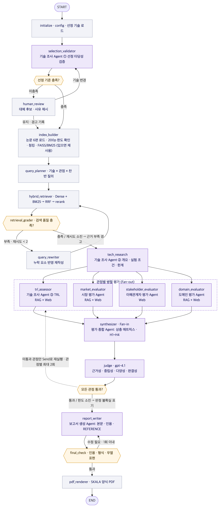

# 1. 과제 개요

## 1.1 분석 배경: KV cache가 왜 병목인가

LLM은 토큰을 하나씩 생성하면서, 앞에서 계산한 Key·Value 텐서를 KV cache에 저장해 두고 다시 사용한다. 재계산 비용은 사라지지만, KV cache의 크기는 **문맥 길이와 동시 요청 수에 비례해 선형으로** 커진다. 그래서 KV cache는 "연산 병목"을 "메모리(HBM) 병목"으로 바꿔 놓는다.

> KV cache 크기 = 2(K·V) × 레이어 수 × KV 헤드 수 × 헤드 차원 × 토큰 수 × 원소 바이트. 예: Llama-3.1-8B(32 레이어, KV 헤드 8, 헤드 차원 128, FP16)는 토큰당 128 KiB이다. 128K 토큰 요청 1건이면 16 GiB로, 모델 가중치(약 16 GB)와 비슷한 크기이다. 80 GB GPU 1장이 가중치를 제외하고 128K 문맥 세션을 동시에 약 4개밖에 유지하지 못한다는 뜻이다.

이 병목을 푸는 접근은 두 진영으로 나뉜다. **SW 진영은 데이터를 작게** 만들고(양자화·압축, 어텐션 구조 변경), **HW 진영은 담을 공간을 넓힌다**(HBM 밖의 호스트·CXL·스토리지 계층으로 확장). 둘은 대립하는 것처럼 보이지만 실제로는 함께 쓰이는 경우가 많다. 예를 들어 압축된 KV는 하위 메모리 계층으로 옮기기도 쉽다.

## 1.2 문제 정의 (선정 도메인 기반)

**선정 도메인: 데이터센터·클라우드 환경의 장문맥·고동시성 LLM 서빙**

<!--w:3.2,12.8-->
| 구분 | 내용 |
|---|---|
| 의사결정 상황 | 장문맥(수십~수백K 토큰)과 다중 턴·에이전트 워크로드가 늘면서, 서빙 사업자는 **GPU당 동시 세션 수와 최대 문맥 길이가 HBM 용량에 묶이는 문제**를 겪는다. GPU를 늘리는 것 말고, KV를 줄이는 SW 기술과 KV를 둘 공간을 늘리는 HW 기술이 대안으로 거론된다. |
| 핵심 문제 | 같은 기술을 두고도 **시장, 이해관계자, 도메인 관점마다 평가가 엇갈린다.** 예: 시장은 즉시 적용 가능성을 높이 보는데, 도메인 관점은 정확도 영향과 엔진 통합 수준을 문제 삼는다. 이 엇갈림을 근거 없이 한 방향으로 요약하면 의사결정이 왜곡된다. |
| 분석 질문 | Q1. 두 기술은 각 관점(TRL, 시장, 이해관계자, 도메인)에서 **어떤 근거로 어떻게 인식되는가?**<br>Q2. **관점 간 일치·상충 지점은 어디이며, 그 원인은 무엇인가?**<br>Q3. 환경(데이터센터 vs 온디바이스)과 결합 사용 여부에 따라 **평가 조건이 어떻게 달라지는가?** (가설 H1~H4) |
| 산출물 성격 | 기술 추천이나 우열 판정이 아니라, **관점별 인식 차이와 그 근거·조건을 추적할 수 있게 정리한 다관점 평가 보고서** |
| 1차 독자 | LLM 인프라 기획·운영 담당자, 메모리 반도체 사업 기획 담당자 |

## 1.3 범위와 설계 원칙

- **범위 안:** SW 기술 1건(TurboQuant)과 HW 기술 1건(ITME)의 4관점 평가, 관점 간 상충 분석, 가설 H1~H4 검증, 자동 생성 보고서(PDF).
- **범위 밖:** 벤치마크 재현 실험, 기술 간 우열·추천 판정, 가격 추정 모델링.
- **중립성:** 두 기술에 같은 기준과 같은 질문 템플릿을 쓰고(대칭), 찬반 근거를 함께 검색하며, 우열 표현을 교정한다.
- **추적성:** 모든 주장에 근거 ID(논문 페이지 또는 URL)를 붙인다. 근거가 없는 주장은 Judge가 걸러낸다.
- **재현성:** 명령 한 줄로 실행된다. 웹 검색 결과와 LLM 응답을 캐시로 커밋하고, `--offline` 옵션으로 다시 재생할 수 있다.

---pagebreak---

# 2. 설계 내용

## 2.1 대상 기술 선정 (A)

### 2.1.1 선정 기준

후보 6개(Doc Pool)를 네 가지 기준으로 5점 척도 채점하고, 가중합 `Σ(기준 점수 × 가중치)`을 계산한다. 가중합과 별개로 **제외 조건** 중 하나라도 해당하면 후보에서 뺀다.

<!--w:2.6,1.6,11.8-->
| 기준 | 가중치 | 판단 질문 |
|---|---|---|
| 비교 공정성 | 35% | 두 기술 모두 모델 학습 이후의 **추론·서빙 단계**에서 KV cache 병목을 직접 다루는가? (같은 적용 계층) |
| 근거 확보성 | 25% | 원 논문과 독립적인 보조 자료를 확보할 수 있고, 장점과 한계를 함께 검증할 수 있는가? |
| 산업 연관성 | 25% | GPU 서빙 생태계나 CXL 메모리 생태계와 연결되어, 실제 도입 주체와 이해관계자를 식별할 수 있는가? |
| 최신성 | 15% | 장문맥·에이전트 워크로드의 최근 문제와 연결되는가? |

**제외 조건:** ① KV cache를 직접 평가 대상으로 삼지 않음 ② 원문(1차 자료)을 확보할 수 없음 ③ 비교 대상과 적용 시점이 크게 다름(예: 사전학습 단계) ④ 성능 수치의 실험 환경과 기준선이 공개되지 않음

### 2.1.2 후보 6개 평가표 (설계 시점 팀 채점)

<!--w:2.3,1.0,1.3,1.3,1.3,1.1,1.2,6.5-->
| 후보 | 진영 | 공정성 | 근거 | 산업 | 최신 | 가중합 | 채점 근거 요약 |
|---|---|---|---|---|---|---|---|
| **TurboQuant** | SW | 5 | 4 | 5 | 4 | **4.60** | 재학습 없이 서빙 중 KV를 온라인 양자화. Google Research·DeepMind 논문(2025-04)과 공식 블로그(2026-03-24). 독립 구현·후속 평가는 실행 단계에서 웹으로 교차 확인 |
| KIVI | SW | 5 | 4 | 3 | 2 | 3.80 | 서빙 단계 2bit 양자화, ICML 2024. TurboQuant 논문의 직접 비교 기준선이라 **baseline 역할**로 활용 |
| DeepSeek MLA | SW | 1 | 5 | 4 | 2 | 2.90 | 어텐션 구조를 바꿔 **사전학습이 필요** → 제외 조건 ③ 해당. 대조점으로만 활용 |
| **ITME** | HW | 5 | 3 | 5 | 5 | **4.50** | vLLM(v0.17.0) 위에 구현, 모델 변경 없음. SK hynix 양산급 CMM과 FPGA로 실측(2026-06). 1차 자료가 **벤더 단일 출처**라 근거 점수는 3 |
| InfiniGen | HW | 4 | 3 | 2 | 2 | 2.95 | 호스트 메모리 오프로딩과 선택적 프리패치(OSDI 2024). 오프라인 가중치 변환(skewing)이 필요해 공정성 4점 |
| CXL-PNM | HW | 3 | 2 | 3 | 4 | 2.90 | CXL 메모리 안에 PNM 연산기를 두어 **실행 위치 자체를 바꿈**(새 연산 HW 필요). 시뮬레이션 중심 preprint(2025-10) |

> 진영별 최고점: SW는 TurboQuant(4.60), HW는 ITME(4.50). MLA는 제외 조건 ③으로 빠지고, KIVI·InfiniGen·CXL-PNM은 보고서에서 기준선·대안 기술로 인용한다.

### 2.1.3 선정 결과와 사유

<!--w:3.0,6.5,6.5-->
| 사유 | SW · Google TurboQuant | HW · ITME (SK hynix, CXL-hybrid 계층 메모리) |
|---|---|---|
| 대칭 평가 가능성 | 재학습 없이 서빙 단계에서 KV를 양자화 → 모델을 바꾸지 않는 기술끼리 같은 기준·질문 템플릿으로 비교 가능 | vLLM 위에 구현된 서빙 계층 기술이고 모델을 바꾸지 않음 → TurboQuant와 같은 평가 틀 적용 가능 |
| 접근 방식 대비 | 데이터를 작게: 3.5bit/채널에서 품질 중립, 2.5bit에서 소폭 저하 보고(LongBench·NIAH, Llama-3.1-8B·Ministral-7B) | 공간을 넓게: KV를 양자화하지 않고 CXL-hybrid 메모리(T3.5)로 TB 규모 확장. NVMe-oF 대비 처리량 1.80배, CPU 오프로드 대비 최대 35.7% 향상 보고 |
| 관점 간 인식 분기 | "추가 HW 없이 기존 GPU에서 메모리 절감"이라는 기대와 "정확도 영향·서빙 엔진 통합 수준"이라는 우려가 공존 | "무손실 용량 확장"이라는 기대와 "원격 계층 지연·인프라 비용·배포 성숙도"라는 제약이 공존 |
| 이해관계자 다양성 | 서빙 엔진 개발자, 클라우드 사업자, 경쟁 KV 압축 진영(KIVI, NVIDIA KVTC 등), 메모리 업계 | 메모리 벤더, 서버·클라우드 사업자, CXL Consortium, 원격 플래시·NVMe 기반 대안 진영(NVIDIA CMX 등). TurboQuant와 **이해관계자 집단이 거의 겹치지 않음** |
| TRL 관찰 가치 | 알고리즘 논문과 오픈소스 구현 중심 → 연구 성과가 프로덕션 도입으로 이어지는 단계를 관찰 | 양산급 모듈로 실측했지만 상용 배포 정보는 제한적 → TRL 4~6 구간의 공개 정보 격차를 관찰 |
| 최신성·산업 연관성 | 빅테크 공개(블로그 2026-03)로 시장·미디어 반응 자료가 풍부 | 2026-06 공개, 국내 메모리 반도체(CXL) 생태계와 직접 연결 |
| 환경·결합 검토 | 온디바이스 등 메모리 제약 환경에서 평가가 달라지는지 확인 가능(H3) | TurboQuant와 결합 가능한 보완 관계인지 관점별로 검토 가능(H4) |

### 2.1.4 알려진 약점 (선정 검증 단계에서 재확인)

- **ITME:** 저자 전원이 SK hynix 소속이고 제품(CMM) 기반으로 실측했다. 1차 근거가 벤더 자료이므로, 시장·이해관계자 관점에서는 **제3자 출처를 따로 확보해야** 한다(출처 다양성 규칙 적용).
- **TurboQuant:** 논문 실험은 단일 A100에서 품질과 왜곡률을 중심으로 이루어졌고, 서빙 엔진 통합과 처리량 수치는 논문에 없다. 블로그의 "최대 8배"는 **H100에서 4bit 대 32bit 키의 attention logit 계산 속도**를 비교한 값이라 기준선 해석에 주의해야 한다.
- 선정은 사람이 했으므로, 기술 조사 Agent의 `selection_validator`가 원문을 근거로 세 가지를 다시 검증한다. ① 같은 문제를 다루는가 ② 적용 계층을 비교할 수 있는가 ③ 공개 근거가 충분한가. 하나라도 미충족이면 사유와 대체 후보를 `selection_validation`에 기록한다. `--interactive` 모드에서는 사람의 확인을 받는다.

## 2.2 설계 (B)

### 2.2.1 기술 선정 방식: Human 기반(2안)과 에이전트 사후 검증

팀이 2.1의 기준으로 TurboQuant와 ITME를 선정하고(`config.yaml`의 `selected_techs`, CLI `--tech sw=turboquant,hw=itme`로 교체 가능), 기술 조사 Agent가 선정 타당성을 사후 검증한다. 에이전트가 검색 결과만으로 대상을 정하면 **최신 자료에 치우치거나 비교 계층이 어긋날** 위험이 있다. 이 구조는 그 위험을 줄이면서, 사람의 선택을 그대로 확정하지 않고 근거로 다시 확인하기 위한 것이다. 에이전트는 **다시 고르지 않고 검증만 한다.**

### 2.2.2 RAG 적용 대상

<!--w:3.0,1.3,5.2,6.5-->
| 에이전트 | RAG | 검색 대상 | 산출물 |
|---|---|---|---|
| 기술 조사 (검증·개요·TRL) | O | 선정 기술 원 논문(primary)과 기준선·대안 논문 | 작동 원리, 실험 조건, 한계, TRL 근거 |
| 시장 평가 | O + Web | 논문 RAG(성능 주장·적용 조건) + 제품·표준·프레임워크 웹 자료 | 시장성, 채택 사례, 생태계 지원의 찬반 근거 |
| 이해관계자 평가 | Web | 기업 발표, 개발자 문서·토론, 산업 분석, 언론 | 경쟁 진영·도입 기업·개발자·투자 업계의 상반된 시각 |
| 도메인 평가 | O + Web | 논문 RAG(실험 환경·워크로드) + 실제 시스템 자료 | 데이터센터 장문맥 서빙의 적합 조건과 제약, 온디바이스 대조 |
| 평가 종합 · Judge · 보고서 | X | 앞 단계에서 구조화된 결과와 근거 ID만 사용 | 상충 매트릭스, 품질 판정, 최종 보고서 |

이해관계자 관점은 **최신 반응**이 핵심이라 논문 RAG의 이점이 작아 웹만 쓴다(Notion 가이드와 일치). 평가 종합, Judge, 보고서 에이전트는 새 사실을 검색하지 않는다. 그래서 근거 없는 내용이 끼어들 수 있는 경로가 관점 에이전트로만 한정된다.

### 2.2.3 코퍼스 구성 (200페이지 한도)

<!--w:2.4,2.2,1.2,1.3,1.9,1.2,5.8-->
| 논문 | arXiv | 페이지 | 진영 | 역할 | 청크 | 활용 |
|---|---|---|---|---|---|---|
| TurboQuant | 2504.19874 | 25 | SW | primary | 21 | 선정 기술 1차 근거 |
| DeepSeek-V2 (MLA) | 2405.04434 | 52 | SW | alternative | 44 | 구조 변경형 대안(대조) |
| KIVI | 2402.02750 | 15 | SW | baseline | 21 | 양자화 계열 기준선 |
| InfiniGen | 2406.19707 | 18 | HW | alternative | 26 | 호스트 오프로딩 대안 |
| ITME | 2606.12556 | 13 | HW | primary | 24 | 선정 기술 1차 근거 |
| CXL-PNM | 2511.00321 | 13 | HW | alternative | 23 | CXL+PNM 대안 |
| **합계** | | **136** | | | **159** | 한도 200p의 68% (`scripts/download_papers.py`가 페이지 수 자동 검증) |

선정 기술 논문 2편만 넣으면 "기준선 대비 어떤 위치인가"라는 질문에 답할 근거가 없다. 그래서 Doc Pool 6편을 **모두** 넣고 `role` 메타데이터로 1차 근거와 비교 근거를 구분한다. 에이전트는 `tech`·`role` 필터로 필요한 범위만 검색한다.

### 2.2.4 문서 처리·인덱싱 파이프라인 (구현 완료)

1. **로딩(PyMuPDF):** 글꼴 크기와 굵기로 절 제목을 인식해 청크마다 `section`을 붙인다. 40% 이상의 페이지에서 반복되는 머리글·바닥글, 쪽번호, arXiv 워터마크를 제거한다. **참고문헌 목록은 제외**하고 부록은 유지한다.
2. **청킹:** 절 경계를 우선 보존하면서 900 토큰(cl100k) 단위로 나누고, 15%(135 토큰)를 겹친다. 문단 → 문장 → 토큰 순으로 분할해 표나 수식 덩어리가 한도를 넘지 않게 한다. 결과는 159개 청크이다.
3. **메타데이터:** `chunk_id`, `doc_id`(arXiv), `tech`, `camp`(SW/HW), `role`(primary/baseline/alternative), `title`, `section`, `page`–`page_end`, `published_at`, `source_type`를 저장한다.
4. **인덱스:** 청크 앞에 `제목 | 절` 머리말을 붙여 임베딩하고 FAISS(IndexFlatIP, 정규화 코사인)에 넣는다. BM25 인덱스를 함께 만든다. 코퍼스 지문(hash)이 같으면 **기존 인덱스를 재사용**하고, 없으면 자동으로 만든다.

### 2.2.5 검색 전략 (Agentic RAG)

1. **질의 계획:** `기술 × 관점 × 입장(지지/반대) × 확인할 지표` 조합으로 질의를 만든다. 반대 근거는 별도 질의로 찾는다. 예: "TurboQuant 장문맥 정확도 저하를 지적하는 결과"
2. **질의 보강:** 한국어 질의를 영어 검색어로 다시 쓴다. 이때 **질문만 보고** 재작성하므로 정답 정보가 섞여 들지 않는다.
3. **하이브리드 검색:** 한국어 dense, 영어 dense, 영어 BM25 세 가지 순위를 **RRF(k=60)** 로 합친다. 그다음 cross-encoder(bge-reranker-v2-m3)로 상위 20개를 다시 정렬하고 top-5를 전달한다.
4. **품질 판정:** `retrieval_grader`가 검색 결과에 기술명, 관점, 수치 또는 한계 조건이 들어 있는지, 찬반 근거가 모두 있는지 판정한다. 부족하면 누락 요소를 반영해 질의를 다시 쓰고 재검색하며, **최대 2회**까지 반복한다. 그래도 부족하면 `근거 부족` 경고를 남긴다.
5. **근거 사용:** 최종 주장마다 근거 ID를 1개 이상 연결한다. 홍보성 주장이나 시장 전망은 독립 출처를 함께 찾는다. 한 출처 도메인이 관점별 인용의 50%를 넘으면 보완 검색을 한다.

### 2.2.6 Embedding 모델 선정: 자체 교차언어 평가

**평가 목적:** 리더보드 순위가 아니라, 본 과제의 실제 검색 조건인 **한국어 질의로 영어 논문 청크를 찾는 교차언어 검색**에서의 성능과 로컬 운영 비용을 직접 측정한다.

**후보(오픈소스 4종):** `BAAI/bge-m3`, `intfloat/multilingual-e5-large`, `Qwen/Qwen3-Embedding-0.6B`, `sentence-transformers/paraphrase-multilingual-MiniLM-L12-v2`(경량 기준선). 모두 다국어 모델이다. 영어 전용 MiniLM-L6은 한국어 질의를 처리할 수 없어 다국어 L12로 바꿨다.

**평가셋 구성 절차 (`eval/`):**

1. **생성:** 논문마다 절을 고르게 나눠 10개씩(총 60개) 청크를 뽑는다. Judge 등급 LLM(gpt-4.1)이 청크 하나에서만 확인할 수 있는 **단일·구체 사실**을 묻는 한국어 질문을 만든다. 영어 구절은 5단어 이상 복사하지 못하게 한다.
2. **자동 QC:** 답할 수 있는가, 구체적인가, 질문만으로 이해되는가를 LLM이 점검하고, 구절 복사 검사를 더해 57/60이 통과했다.
3. **복수 정답 풀링:** 후보 4개 모델과 BM25의 top-10을 합친 1,103쌍을 기준 답에 비추어 엄격하게 판정했다. 정답 청크가 5개 이상인 **포괄적 질문 7개는 제외**하고, 나머지는 복수 정답으로 기록했다(29문항).
4. **균형 선택:** 논문별 7문항, 총 **42문항**으로 구성했다(SW 21 / HW 21).
5. **사람 검수:** 11쌍(26%)을 직접 대조 검수했다. LLM 판정 오류 1건(`turboquant-012`)을 찾아 수정했고, 내역은 `eval/qa_review.md`에 있다.
6. **누설 차단:** 영어 재작성 질의는 **질문만 보고** 생성한다. 초기 버전에서 정답 청크를 본 LLM이 재작성해 BM25(EN) 점수가 0.816으로 부풀려졌던 것을 발견해 바로잡았다(수정 후 0.770).

**공정성 통제:** 청크, 질의, FAISS 설정을 동일하게 두고 모델만 교체했다. 각 모델은 모델 카드가 권장하는 질의 설정을 썼다(e5: `query:`/`passage:` 접두어, Qwen3: 기본 `query` 프롬프트). Qwen3는 프롬프트 민감도가 커서(MRR 0.548→0.631) **가장 좋은 설정**으로 비교했다.

**결과 1. 임베딩 후보 (dense only, 한국어 질의)**

<!--w:3.6,1.1,1.1,1.1,1.3,2.1,1.2,1.3,1.1,2.1-->
| 모델 | Hit@1 | Hit@3 | Hit@5 | MRR@10 | MRR SW / HW | 최대 토큰 | 인덱싱(s) | 질의(ms) | MPS 메모리(MB) |
|---|---|---|---|---|---|---|---|---|---|
| **bge-m3** | 0.548 | 0.857 | 0.905 | 0.703 | 0.748 / 0.659 | 1024 | 31.2 | 7.2 | 3049 |
| qwen3-embedding-0.6b | 0.500 | 0.738 | 0.810 | 0.631 | 0.770 / 0.493 | 1024 | 27.7 | 10.1 | 3265 |
| multilingual-e5-large | 0.476 | 0.738 | 0.857 | 0.626 | 0.662 / 0.589 | 512 | 17.4 | 7.7 | 3081 |
| multilingual-minilm-l12 | 0.262 | 0.405 | 0.500 | 0.377 | 0.378 / 0.375 | 128 | 0.6 | 1.0 | 1065 |

> 측정 환경: Apple M5(16 GB, MPS) · 159 청크 · 42문항. 인덱싱은 전체 청크 인코딩 시간, 질의는 1건당 평균. Hit@k는 복수 정답 중 하나라도 top-k 안에 있으면 적중, MRR은 첫 적중 순위의 역수 평균(top-10).

**결과 2. 검색 구성 (bge-m3 기준, 같은 평가셋)**

<!--w:8.4,1.9,1.9,1.9,1.9-->
| 검색 구성 | Hit@1 | Hit@3 | Hit@5 | MRR@10 |
|---|---|---|---|---|
| Dense (한국어 질의) | 0.548 | 0.857 | 0.905 | 0.703 |
| BM25 (한국어 질의) | 0.548 | 0.810 | 0.881 | 0.697 |
| BM25 (영어 재작성 질의) | 0.643 | 0.905 | 0.929 | 0.770 |
| 하이브리드 RRF: Dense(KO) + BM25(EN) | 0.643 | 0.929 | 0.929 | 0.786 |
| 3중 하이브리드 RRF: Dense(KO) + Dense(EN) + BM25(EN) | 0.667 | 0.881 | 0.952 | 0.790 |
| **3중 하이브리드 RRF + reranker (bge-reranker-v2-m3) ← 채택** | 0.786 | 0.952 | 0.976 | 0.863 |

<!--img:15.8-->

**선정 기준표와 결정**

<!--w:3.0,3.3,3.3,3.3,3.1-->
| 기준 (가중) | bge-m3 | multilingual-e5-large | qwen3-embedding-0.6b | multilingual-minilm-l12 |
|---|---|---|---|---|
| 교차언어 정확도 (40%) | MRR 0.703 · Hit@5 0.905 | MRR 0.626 · Hit@5 0.857 | MRR 0.631 · Hit@5 0.810 | MRR 0.377 · Hit@5 0.500 |
| 진영 간 균형 (20%) | SW 0.748 / HW 0.659 | SW 0.662 / HW 0.589 | SW 0.770 / HW 0.493 | SW 0.378 / HW 0.375 |
| 청크 수용 길이 (15%) | 1024 토큰 (전체 수용) | 512 토큰 (900 토큰 청크 잘림) | 1024 토큰 (전체 수용) | 128 토큰 (900 토큰 청크 잘림) |
| 로컬 비용 (15%) | 인덱싱 31.2s · 질의 7.2ms · 3049MB | 인덱싱 17.4s · 질의 7.7ms · 3081MB | 인덱싱 27.7s · 질의 10.1ms · 3265MB | 인덱싱 0.6s · 질의 1.0ms · 1065MB |
| 라이선스 (10%) | MIT | MIT | Apache-2.0 | Apache-2.0 |
| 판정 | **채택** | 차선 (512 토큰 제한) | HW 질의 편차 큼 | 경량 기준선 |

> **결정: 임베딩 `BAAI/bge-m3`, 검색 구성 "3중 하이브리드(RRF) + bge-reranker-v2-m3".** bge-m3는 전체 Hit@1·3·5와 MRR이 모두 가장 높았다. Qwen3는 SW 질문 MRR이 조금 더 높았지만(0.770 vs 0.748) HW 질문에서 0.493으로 크게 떨어졌다. 본 과제는 두 진영 문서를 같은 비중으로 검색하므로 **진영 간 균형(bge-m3: SW 0.748 / HW 0.659)** 을 중시했다. 최대 1,024 토큰을 받아 900 토큰 청크를 잘리지 않고 인코딩하며, MIT 라이선스이다. 설계 초안에서는 Qwen3-Embedding-0.6B를 가정했지만, 측정 결과 교차언어 정확도가 낮아 **측정 결과에 따라 교체했다.** reranker는 질의당 약 4.7초가 더 들지만, 보고서 생성은 대화형이 아닌 배치 작업이므로 비용 대비 정확도 개선(MRR +0.073)이 크다고 판단해 채택했다. 시간이 부족할 때는 `--no-rerank` 옵션으로 끌 수 있다.

### 2.2.7 도구 정의 (외부 정보 검색·요약)

<!--w:4.2,3.6,8.2-->
| 도구(`@tool`) | 사용 에이전트 | 동작 |
|---|---|---|
| `paper_retrieve(query, camp, tech, role, k)` | 기술 조사, 시장, 도메인 | 2.2.5의 하이브리드 RAG. 메타데이터 필터를 쓰고, 근거 ID(`P:<chunk_id>`)·페이지·절을 반환 |
| `web_search(query, days, stance)` | TRL(7~9 신호), 시장, 이해관계자, 도메인 | Tavily 검색. 결과를 `data/web_cache/`에 날짜 스탬프와 함께 캐시하고 `--offline`이면 캐시만 사용. URL·게시일·발행 주체·벤더/제3자 라벨이 붙은 근거 ID(`W:<hash>`)를 반환 |
| `summarize_sources(docs, focus)` | 관점 에이전트 공통 | 근거 묶음을 초점별로 요약. **원 근거 ID를 보존**하는 구조화 출력이며, 근거 없는 문장은 만들지 않음 |

### 2.2.8 LLM 구성과 재현성

<!--w:3.2,12.8-->
| 항목 | 설정 |
|---|---|
| Generator | `gpt-4.1-mini` (키로 호출 가능한지 확인함, 비용 효율) · temperature 0 · seed 42 |
| Judge | `gpt-4.1` (Generator와 **다른 모델**로 교차 검증해 자기평가 편향을 줄임) |
| 캐시 | LLM 응답(SQLite)과 웹 검색 결과를 repo에 커밋. `--offline`이면 **API 키 없이도** 같은 보고서가 다시 생성됨 |
| 추적 | LangSmith tracing, `outputs/logs/` 실행 로그, State의 `audit_log` |

---pagebreak---

## 2.3 평가 관점 및 기준 (C)

### 2.3.1 공통 원칙

본 평가는 "어느 기술이 우수한가"를 판정하지 않는다. **같은 두 기술이 관점에 따라 어떻게 다르게 평가되는지**를 드러내는 것이 목표이다.

<!--w:2.8,13.2-->
| 원칙 | 적용 방법 |
|---|---|
| 찬반 균형 | 관점별로 "장점·도입 근거"와 "한계·비판 근거"를 기술마다 **각 2건 이상** 확보한다. 한쪽만 확보되면 재검색(Loop)한다. |
| 출처 다양성 | 한 도메인(예: google.com, skhynix.com)의 비중이 관점별 근거의 **50%를 넘지 않게** 한다. 모든 웹 근거에 벤더/제3자 라벨을 붙인다. |
| 근거 추적성 | 모든 정량 주장과 정성 판단에 근거 ID(논문 페이지 또는 URL)를 1개 이상 연결한다. 근거가 없는 문장은 Judge가 `unsupported`로 표시하고 보고서에서 뺀다. |
| 대칭성 | 두 기술에 같은 평가 항목, 질문 템플릿, 검색 횟수 한도를 적용한다. |
| 우열 표현 교정 | "우수하다", "열등하다", "더 낫다" 같은 표현을 사전과 LLM으로 찾아내 "~ 조건에서 ~ 근거가 보고됨" 식의 조건부 서술로 바꾼다. |

### 2.3.2 도메인 선정

<!--w:4.2,9.2,2.6-->
| 도메인 후보 | 적합성 검토 | 채택 |
|---|---|---|
| 데이터센터·클라우드 장문맥 LLM 서빙 | 두 기술 모두 KV cache가 급증하는 장문맥·대규모 배치 상황을 문제로 정의한다. 논문 실험 환경(GPU 서버, CXL 서버·vLLM)과 직접 일치하고, 산업 연관성(vLLM, CXL 표준)도 이 도메인에 집중되어 있다. | **주 도메인** |
| 온디바이스·엣지 추론 | 자원·전력 제약이 커서 평가 기준이 달라진다. 두 기술 모두 직접 근거가 적어, 환경에 따른 평가 변화(H3)를 보는 **대조군**으로만 쓴다. | 대조군 |
| 멀티모달 서빙 | 두 논문 모두 텍스트 기반 실험만 제공해 근거가 부족하다. | 제외 |

주 도메인의 워크로드는 두 가지로 한정한다. **(W1) 장문맥 배치 추론**(문서 QA·요약, 32K~128K+)과 **(W2) 고동시성 다중 턴·에이전트 서빙**(prefix KV 재사용)이다.

### 2.3.3 관점별 평가 대상 · 기준 · 증거 유형 · 출력 형식

<!--w:2.2,3.3,4.6,2.9,3.0-->
| 관점 (담당) | 평가 대상 | 평가 기준 | 증거 유형 | 출력 형식 (State) |
|---|---|---|---|---|
| ① 기술 성숙도 · TRL (기술 조사 Agent) | 각 기술의 원 논문, 공식 구현체, 제품화 신호 | 구현 검증 수준(시뮬레이션 / 실제 HW 실측 / 프로토타입), 재현 가능성(코드·데이터 공개), 서빙 프레임워크 반영, 고객 샘플·제품 출시 | 논문 RAG(실험 조건), 웹(릴리스·발표) | `trl_result`: 기술별 TRL 단계, 근거표(출처·단계·공개 한계), 신뢰도 |
| ② 시장성 (시장 평가 Agent) | TurboQuant: 추론 서빙 최적화 SW 세그먼트 / ITME: CXL 메모리 확장 HW 세그먼트 | 시장 규모·성장률, 상용화·채택 사례, 생태계 지원(vLLM·TensorRT-LLM·SGLang, CXL Consortium·OCP), 도입 비용 구조(재학습 불필요 vs HW 투자) | 시장 리포트, 제품 발표, 프레임워크 문서, 논문 RAG(적용 조건) | `market_result`: 기준별 찬반 근거와 인식 점수 |
| ③ 이해관계자 (이해관계자 평가 Agent) | (a) 클라우드·데이터센터 사업자 (b) GPU·메모리 벤더(경쟁 진영 포함) (c) 개발자 커뮤니티(vLLM 등 OSS) (d) 투자·애널리스트·미디어 | 집단별 공식 입장·발언, 커뮤니티 반응(이슈·포럼), 대응 기술, 채택 장벽, 투자·표준화 참여 | 웹(기업 발표, 개발자 토론, 언론·분석) | `stakeholder_result`: 집단 × 입장(지지/우려/중립) 매트릭스와 근거 |
| ④ 도메인 적합성 (도메인 평가 Agent) | W1 장문맥 배치 추론, W2 고동시성 다중 턴 서빙 (+ 온디바이스 대조) | 비용(TCO 구조), 지연(TTFT·TPOT), 처리량·동시성, 정확도 영향, 통합 난이도(엔진·드라이버·HW 변경), 온디바이스 제약(전력·메모리·HW 가용성) | 논문 RAG(벤치마크 조건), 웹(실제 시스템 사례) | `domain_result`: 워크로드별 적합 조건·제약, 환경별 대조표 |

### 2.3.4 TRL 추정 규칙 (공개 정보 기반 추정)

<!--w:1.4,6.6,8.0-->
| TRL | 단계 정의 | KV cache 기술에서 인정하는 공개 증거 예시 |
|---|---|---|
| 1–3 | 원리 관찰 · 개념 정립 · 실험실 개념 검증 | 논문의 이론 분석, 시뮬레이션, 단일 GPU·오픈 모델 실험 |
| 4 | 실험실 환경 구성요소 검증 | 실제 HW(GPU·CXL 모듈)에서 구성요소를 통합해 실험 |
| 5 | 유사 환경 통합 검증 | 실제 서빙 엔진(vLLM 등)과 실제 규모 워크로드에서 통합 검증 |
| 6 | 실제 환경 유사 조건 시스템 시연 | 프로토타입 시스템 시연, 공개 데모, 파트너 평가 |
| 7 | 실제 운용 환경 시제품 시연 | 고객사 파일럿·샘플 공급, 실서비스 시험 적용 발표 |
| 8 | 시스템 완성 · 양산 적합성 | 정식 제품 출시, 메인라인 프레임워크 정식 기능 탑재 |
| 9 | 실제 운용 · 상용 납품 | 상용 서비스 운영 사례, 양산 납품·실적 공시 |

> 공개 정보의 한계: TRL 1~3은 논문·학회로 대부분 공개되고, 7~9는 샘플·양산 발표로 일부 공개된다. **TRL 4~6은 수율·실측치가 영업 비밀이라 공개 정보 공백이 가장 크다.** KV cache 기술은 논문 발표와 실제 채택 사이에 시차도 있다. 따라서 TRL은 **"공개 정보 기반 추정"임을 반드시 표기**하고 단일 값이 아닌 범위(예: 4–5)와 신뢰도로 제시한다.

### 2.3.5 척도와 상충 판정 규칙

- 관점마다 세부 기준을 **인식 점수 5점 척도**로 채점한다(1 부정적 인식 우세 · 3 혼재·중립 · 5 긍정적 인식 우세). 채점 근거 문장과 근거 ID를 반드시 함께 기록한다.
- 관점 점수는 세부 기준의 **근거 수 가중 평균**이다. 근거가 1건뿐인 기준은 가중치를 절반으로 낮춘다. 신뢰도(상/중/하)는 근거 양이 아니라 1차 자료인지, 독립 출처로 교차 확인했는지, 실험 조건이 일치하는지로 매긴다.
- TRL은 비교용으로만 5점 척도에 대응시킨다(1–2→1, 3–4→2, 5–6→3, 7–8→4, 9→5).
- **상충 판정은 기술 안에서만 한다.** 같은 기술의 두 관점 점수 차가 2 이상이면 "상충", 1이면 "부분 상충", 0이면 "일치"이다. 기술 간 합계, 순위, 승패는 **산출하지 않는다.**

<!--w:2.6,4.4,4.4,4.6-->
| 관점 (보고서 출력 형식) | TurboQuant (SW) | ITME (HW) | 비고 |
|---|---|---|---|
| TRL | 단계(범위) + 근거 요약 + 신뢰도 | 단계(범위) + 근거 요약 + 신뢰도 | 공개 정보 기반 추정 |
| 시장성 | 인식 점수 + 찬·반 근거 요약 | 인식 점수 + 찬·반 근거 요약 | |
| 이해관계자 | 집단별 입장 요약 | 집단별 입장 요약 | |
| 도메인 적합성 | 적합 조건 / 제약 | 적합 조건 / 제약 | 온디바이스 대조 |
| **관점 간 상충** | 일치/상충 판정 + 관련 가설 태그 | 일치/상충 판정 + 관련 가설 태그 | 보고서 5장 재인용 |

### 2.3.6 검증 가설 (결론이 아닌 가설)

팀 가설과 초기 가설을 합쳐 4개로 정리했다. 보고서는 각 가설을 **지지 / 부분 지지 / 기각 / 판단 보류(근거 부족)** 로 판정하고 근거 ID를 붙인다.

<!--w:1.0,8.2,6.8-->
| ID | 가설 | 검증 방법 |
|---|---|---|
| H1 | 기술 성숙도(TRL)와 시장 관점의 인식은 같은 방향을 가리키지 않을 수 있다. 논문·오픈소스 단계의 SW 기술이 시장 기대는 높고, 실측 검증된 HW 기술은 채택 신호가 제한적일 수 있다. | 기술별 TRL 대응 점수와 시장 인식 점수를 비교해 괴리 확인 |
| H2 | 이해관계자 반응은 기술 특성 자체보다 소속 생태계(빅테크 SW 생태계 vs 메모리·CXL 표준 생태계)의 영향을 더 많이 반영할 수 있다. | 이해관계자 근거를 "기술 특성 언급"과 "생태계·전략 언급"으로 태깅해 비중 비교 |
| H3 | 적용 환경(데이터센터 장문맥 서빙 vs 온디바이스)에 따라 두 기술의 적용 조건과 제약에 대한 평가가 달라질 수 있다. | 도메인 평가의 환경별 대조표에서 평가 방향이 바뀌는 기준 확인 |
| H4 | 두 접근은 경쟁보다 보완 관계일 수 있다(압축된 KV는 하위 계층으로 옮기기 쉬움). 즉시 적용성(SW)과 무손실 용량 확장(HW)은 서로 다른 채택 주체(기존 GPU 보유 기업 vs 신규 인프라 투자 기업)에게 호소할 수 있다. | 결합 사용 근거 검색, 시장·이해관계자 근거를 채택 주체 유형별로 태깅 |

### 2.3.7 확증편향 방지 장치 요약

1. **찬반 양면 검색:** 관점 에이전트는 기술마다 지지 질의와 반대 질의를 짝으로 실행한다.
2. **출처 다양성 할당:** 도메인 비중이 50% 이하가 되도록 하고, 벤더/제3자 라벨을 붙인다(ITME·TurboQuant 모두 1차 자료가 벤더 발표이므로 필수).
3. **인용 필수:** 근거가 없는 주장은 Judge가 삭제하거나 재작성을 요구한다.
4. **대칭 처리:** 두 기술에 같은 템플릿, 같은 검색 한도, 같은 채점 기준을 적용한다.
5. **교차 모델 Judge:** Generator(gpt-4.1-mini)와 다른 모델인 gpt-4.1이 채점하고, **미달 관점만** 다시 실행한다.
6. **표현 점검:** 우열 어휘 사전으로 검사하고 LLM으로 교정한다(`final_check`).

---pagebreak---

## 2.4 그래프 설계 (D)

### 2.4.1 에이전트 설계

Notion 가이드의 6개 에이전트를 그대로 두고, 중립성을 **코드로 보장하는** 품질 게이트인 Judge 1개를 추가했다. Judge는 새 사실을 만들지 않고 다른 에이전트의 산출물을 채점만 하므로 역할이 겹치지 않는다. 검색 품질 판정, 질의 재작성, PDF 변환은 LLM 판단 주체가 아닌 **보조 노드**로 두어 불필요한 에이전트를 만들지 않았다.

<!--w:2.4,2.7,3.2,1.1,2.1,2.1,2.4-->
| 에이전트 | 구현 노드 | 역할 | RAG | 입력 State | 출력 State | 책임 경계 (하지 않는 일) |
|---|---|---|---|---|---|---|
| 기술 조사 | `selection_validator` `tech_research` `trl_assessor` | ① 선정 검증 ② 원문에서 개요·실험 조건·한계 추출 ③ TRL 추정 | O (+Web: TRL 7–9 신호) | `selected_techs` `retrieved_chunks` | `selection_validation` `tech_brief` `trl_result` `evidence` | 기술을 다시 고르지 않음, 시장·이해관계자 판단 안 함 |
| 시장 평가 | `market_evaluator` | 시장 규모, 채택 사례, 생태계 지원 | O + Web | `tech_brief` | `market_result` `evidence` | 기술 원리 재조사 안 함 |
| 이해관계자 평가 | `stakeholder_evaluator` | 경쟁 진영·도입사·개발자·투자업계 시각 | Web | `tech_brief` | `stakeholder_result` `evidence` | 성능 수치 판단 안 함 |
| 도메인 평가 | `domain_evaluator` | 장문맥 서빙 적합 조건·제약, 온디바이스 대조 | O + Web | `tech_brief` | `domain_result` `evidence` | 시장 전망 판단 안 함 |
| 평가 종합 | `synthesizer` | 관점 간 일치·상충 매트릭스, H1~H4 판정 | X | 4개 관점 결과, `evidence` | `synthesis` | 새 검색 안 함, 기술 간 순위 산출 안 함 |
| Judge | `judge` | 관점별 근거성·중립성·다양성·완결성 채점, 미달 관점 지정 | X | 4개 관점 결과, `synthesis`, `evidence` | `judge_scores` `failed_perspectives` `perspective_retry_count` | 내용을 직접 고치지 않음(피드백만) |
| 보고서 생성 | `report_writer` | 목차대로 본문 작성, 인용·REFERENCE 정리 | X | 전체 결과, `judge_scores`, `warnings` | `report_markdown` `references` | 근거 ID 없는 주장 추가 안 함 |

**보조 노드:** `initialize`, `human_review`, `index_builder`(로드·한도 확인·청킹·인덱싱), `query_planner`, `hybrid_retriever`, `retrieval_grader`, `query_rewriter`, `final_check`, `pdf_renderer`

**관점 에이전트 내부 루프:** 각 관점 에이전트는 노드 안에서 자기교정 루프를 돈다. `paper_retrieve`/`web_search`로 검색하고, 관련성과 찬반 균형을 평가하고, 부족하면 재질의하는 과정을 **최대 2회** 반복한다. Judge가 재실행을 지시하면 `judge_scores`의 피드백을 추가 질의 조건으로 쓴다.

### 2.4.2 State 설계

병렬 노드가 같은 값을 동시에 덮어쓰지 않도록 **네 관점 결과를 각각 독립된 키**에 둔다. 여러 노드가 누적하는 필드에만 reducer(ID 기준 중복 제거 병합, 이어붙이기)를 쓴다.

<!--w:3.3,2.6,2.8,3.0,4.3-->
| State 키 | 타입 | 작성 노드 | 읽는 노드 | 설명 · 갱신 방식 |
|---|---|---|---|---|
| `run_id` | `str` | initialize | 전체 | 실행 추적 ID(LangSmith·로그 연결) |
| `selected_techs` | `list[Technology]` | initialize, human_review | selection_validator, query_planner | 선정 기술 2건(config/CLI), 진영, 선정 사유 |
| `selection_validation` | `SelectionValidation` | selection_validator | human_review, report_writer | 4개 기준 점수, 원문 근거, 약점, 통과 여부 |
| `document_manifest` | `list[DocumentMeta]` | index_builder | report_writer | 논문·페이지 수·해시·역할, 200p 한도 확인 결과 |
| `index_status` | `IndexStatus` | index_builder | hybrid_retriever, report_writer | 청크 수, 모델, 재사용 여부, 코퍼스 지문 |
| `queries` | `dict[str, list[Query]]` | query_planner, query_rewriter | hybrid_retriever | 기술 × 관점 × 찬반별 질의(재작성 시 교체) |
| `retrieved_chunks` | `dict[str, list[Evidence]]` | hybrid_retriever | retrieval_grader, tech_research | 공통 RAG 검색 결과(청크·점수·페이지) |
| `retrieval_grade` | `RetrievalGrade` | retrieval_grader | 라우터 | 관련성·범위·찬반 균형 판정과 누락 요소 |
| `retrieval_retry_count` | `int` | query_rewriter | 라우터 | 공통 검색 재시도 횟수(최대 2) |
| `evidence` | `Annotated[list[Evidence], merge_by_id]` | 모든 조사·평가 노드 | synthesizer, judge, report_writer | 논문(P:)·웹(W:) 근거 저장소. **병렬 쓰기를 ID 기준으로 병합** |
| `tech_brief` | `dict[str, TechBrief]` | tech_research | 4개 관점 노드, synthesizer | 기술별 원리, 적용 범위, 실험 조건, 한계 |
| `trl_result` | `PerspectiveResult` | trl_assessor | synthesizer, judge, report_writer | 기술별 TRL 범위, 근거표, 공개 한계, 신뢰도 |
| `market_result` | `PerspectiveResult` | market_evaluator | synthesizer, judge, report_writer | 시장 규모·채택·생태계 찬반 근거와 점수 |
| `stakeholder_result` | `PerspectiveResult` | stakeholder_evaluator | synthesizer, judge, report_writer | 이해관계자 집단 × 입장 매트릭스 |
| `domain_result` | `PerspectiveResult` | domain_evaluator | synthesizer, judge, report_writer | 워크로드별 적합 조건·제약, 온디바이스 대조 |
| `synthesis` | `SynthesisResult` | synthesizer | judge, report_writer | 관점 × 기술 매트릭스, 상충 목록, H1~H4 판정 |
| `judge_scores` | `dict[str, JudgeScore]` | judge | 라우터, 관점 노드(재실행 시), report_writer | 관점별 4항목 점수, 피드백, unsupported 주장 ID |
| `failed_perspectives` | `list[str]` | judge | 라우터 | 재실행할 관점(통과 시 빈 목록) |
| `perspective_retry_count` | `dict[str, int]` | judge | 라우터, report_writer | 관점별 재실행 횟수(각 최대 2) |
| `report_markdown` | `str` | report_writer | final_check, pdf_renderer | 인용 번호가 연결된 보고서 원문 |
| `references` | `list[Reference]` | report_writer | final_check, pdf_renderer | **본문에 실제로 인용된** 근거만 Notion 형식으로 정리 |
| `report_retry_count` | `int` | final_check | 라우터 | 보고서 형식 수정 횟수(최대 1) |
| `report_pdf_path` | `str` | pdf_renderer | app.py | 생성된 PDF 경로 |
| `warnings` | `Annotated[list[str], add_unique]` | 여러 노드 | report_writer, final_check | 근거 부족, 재시도 초과, 출처 편중 경고 → 보고서 한계점에 반영 |
| `audit_log` | `Annotated[list[AuditEvent], add]` | 전체 | final_check, 로그 | 노드, 시각, 질의, 사용 근거, 모델, 판정 |

주요 객체의 최소 구조는 다음과 같다.

```
Evidence          = {evidence_id, kind(paper|web), claim, summary, source_url|doc_id, title, publisher,
                     published_at, page, section, tech, perspective, stance(pro|con|neutral),
                     source_class(vendor|third_party|academic), domain}
PerspectiveResult = {perspective, by_tech: {tech_id: {criteria: [{name, score_1to5, rationale, evidence_ids}],
                     summary, pro_ids, con_ids, limitations, confidence(high|mid|low)}}}
SynthesisResult   = {matrix: {tech_id: {perspective: {score, one_liner}}}, conflicts: [{tech_id, pair,
                     gap, explanation, hypothesis_tags}], hypotheses: {H1..H4: {verdict, rationale, evidence_ids}}}
JudgeScore        = {grounding, neutrality, source_diversity, completeness (1-5), passed,
                     feedback, unsupported_claim_ids, checks{max_domain_share, pro_count, con_count, lexicon_hits}}
```

### 2.4.3 Graph 흐름

흐름은 **초기화 → 선정 검증 → 문서 인덱싱·검색(Loop) → 기술 조사 → 4개 관점 병렬 평가(Fan-out) → 종합(Fan-in) → Judge(Branch·선택적 재실행) → 보고서 생성·검수(Loop) → PDF** 순서이다. 아래 소스는 `docs/graph_design.mmd`에 있고, 구현이 끝나면 LangGraph의 `draw_mermaid_png`로 뽑은 실제 그래프(`docs/graph.png`)와 대조한다.

```
flowchart TD
    START([START]) --> INIT["initialize · config · 선정 기술 로드"]
    INIT --> VAL["selection_validator<br/>기술 조사 Agent ① 선정 타당성 검증"]
    VAL --> VQ{{"선정 기준 충족?"}}
    VQ -->|미충족| HUM["human_review<br/>대체 후보 · 사유 제시"]
    HUM -->|기술 변경| VAL
    HUM -->|유지 · 경고 기록| IDX
    VQ -->|충족| IDX["index_builder<br/>논문 6편 로드 · 200p 한도 확인 · 청킹 · FAISS/BM25 (있으면 재사용)"]
    IDX --> QP["query_planner · 기술 × 관점 × 찬반 질의"]
    QP --> RET["hybrid_retriever · Dense + BM25 → RRF → rerank"]
    RET --> RG{{"retrieval_grader · 검색 품질 충족?"}}
    RG -->|"부족 · 재시도 < 2"| RW["query_rewriter<br/>누락 요소 반영 재작성"]
    RW --> RET
    RG -->|"충족 / 재시도 소진 → 근거 부족 경고"| TR["tech_research<br/>기술 조사 Agent ② 개요 · 실험 조건 · 한계"]
    subgraph FAN["관점별 병렬 평가 (Fan-out)"]
        direction LR
        TRL["trl_assessor<br/>기술 조사 Agent ③ TRL<br/>RAG + Web"]
        MK["market_evaluator<br/>시장 평가 Agent<br/>RAG + Web"]
        SH["stakeholder_evaluator<br/>이해관계자 평가 Agent<br/>Web"]
        DM["domain_evaluator<br/>도메인 평가 Agent<br/>RAG + Web"]
    end
    TR --> TRL
    TR --> MK
    TR --> SH
    TR --> DM
    TRL --> SY["synthesizer · Fan-in<br/>평가 종합 Agent: 상충 매트릭스 · H1~H4"]
    MK --> SY
    SH --> SY
    DM --> SY
    SY --> JD["judge · gpt-4.1<br/>근거성 · 중립성 · 다양성 · 완결성"]
    JD --> JQ{{"모든 관점 통과?"}}
    JQ -.->|"미통과 관점만 Send로 재실행 · 관점별 최대 2회"| FAN
    JQ -->|"통과 / 한도 소진 → 판정 불확실 표기"| RWR["report_writer<br/>보고서 생성 Agent: 본문 · 인용 · REFERENCE"]
    RWR --> FC{{"final_check · 인용 · 형식 · 우열 표현"}}
    FC -->|"수정 필요 · 1회 이내"| RWR
    FC -->|통과| PDF["pdf_renderer · SKALA 양식 PDF"]
    PDF --> END([END])
    classDef agent fill:#EEE8FA,stroke:#7F4ACB,color:#161A58;
    classDef util fill:#F2F3F8,stroke:#9AA0B8,color:#161A58;
    classDef gate fill:#FFF6E5,stroke:#D08A00,color:#3A2A00;
    class VAL,TR,TRL,MK,SH,DM,SY,JD,RWR agent;
    class INIT,HUM,IDX,QP,RET,RW,PDF util;
    class VQ,RG,JQ,FC gate;
    style FAN fill:#FBFAFE,stroke:#7F4ACB,stroke-dasharray:4 3,color:#161A58
```

<!--img:9.9-->

### 2.4.4 분기 · 합류 · 종료 규칙

1. **선정 검증 분기:** 세 항목이 모두 충족되면 `index_builder`로 간다. 미충족이면 `human_review`로 간다. `--interactive`에서는 LangGraph `interrupt`로 사람이 확인하고, 기본 실행에서는 경고를 기록한 뒤 진행한다(자동 재현성 확보).
2. **검색 루프:** `retrieval_grader`가 부족으로 판정하고 `retrieval_retry_count < 2`이면 `query_rewriter`로 가서 다시 `hybrid_retriever`로 돌아온다. 한도를 다 쓰면 경고를 남기고 진행한다.
3. **Fan-out:** `tech_research` 다음 4개 관점 노드를 **같은 superstep에서 병렬**로 실행한다. 노드마다 자기 결과 키에만 쓰므로 충돌이 없고, 공유 필드(`evidence`, `warnings`, `audit_log`)는 reducer로 병합한다.
4. **Fan-in:** `synthesizer`는 `defer=True`로 등록해 **그 superstep에서 실행된 관점 노드가 모두 끝난 뒤** 한 번만 실행된다. 선택적 재실행으로 일부 관점만 다시 돌 때도 멈추지 않는다.
5. **Judge 분기(Branch):** 조건부 엣지가 `failed_perspectives`를 읽는다. 해당 관점 노드에만 `Send(node, {feedback})`를 보내 다시 실행하고, 결과를 교체한 뒤 종합과 Judge를 다시 거친다. `perspective_retry_count[관점] ≥ 2`이면 더 돌리지 않고 해당 관점을 `판정 불확실`로 표기한 뒤 보고서로 간다.
6. **보고서 검수 루프:** `final_check`가 아래 항목을 확인한다. 실패하고 `report_retry_count < 1`이면 `report_writer`로 되돌린다. 순서는 먼저 검수하고 그다음 PDF 변환이다.
   - 핵심 주장마다 유효한 근거 ID가 있는가
   - REFERENCE가 실제 인용과 일치하는가
   - SUMMARY 분량이 ½페이지 이내인가
   - 우열 어휘가 남아 있는가
7. **종료 보장:** 모든 루프에 횟수 한도가 있다(검색 2, 관점별 재실행 2, 보고서 1). 최악의 경우에도 그래프가 반드시 끝난다.

### 2.4.5 Judge 통과 기준

관점마다 LLM 채점 4항목(5점 척도)과 **코드로 계산하는 결정적 검사**를 함께 적용한다. 하나라도 미달하면 그 관점만 다시 실행한다.

<!--w:2.8,7.2,6.0-->
| 항목 | 통과 기준 | 미달 시 조치 |
|---|---|---|
| 근거성 (LLM) | 4점 이상. 핵심 주장마다 근거 ID가 있고 근거가 주장을 직접 뒷받침함 | unsupported 주장 삭제 또는 재작성 |
| 중립성 (LLM) | 4점 이상. 장점과 제약을 함께 제시하고, 근거 없는 우열·추천 표현이 없음 | 해당 관점 재작성 |
| 출처 다양성 (LLM + 코드) | 한 도메인 비중 ≤ 50%, 1차 자료와 독립 자료가 구분됨 | 해당 관점 재검색 |
| 완결성 (LLM) | 정의된 평가 기준과 두 기술을 모두 다룸 | 누락 기준 보완 |
| 합계 | 4항목 합 16점 이상 | 해당 관점 재실행 |
| 찬반 균형 (코드) | 기술별 pro ≥ 2, con ≥ 2 | 부족한 쪽 재검색 |
| 우열 어휘 (코드) | 사전 검사 0건 | 교정 후 재검사 |

## 2.5 평가 보고서 목차 초안 (E)

Notion 참고 목차의 순서를 그대로 따르고, 설계에서 필요한 항목(TRL, 상충 매트릭스, 가설 검증)을 하위 절로 넣었다. 각 장은 State 키와 1:1로 대응하므로, 보고서 생성이 설계를 그대로 따르는지 추적할 수 있다.

<!--w:4.0,7.8,4.2-->
| 장 | 구성 | 원천 State |
|---|---|---|
| **SUMMARY** | ½페이지 이내. 관점 간 핵심 엇갈림 3~5개, H1~H4 판정 한 줄씩, "우열 판정 아님" 명시 | `synthesis` |
| 1. 분석 배경 | 1.1 KV cache 병목 · 1.2 두 진영의 접근과 병용 가능성 · 1.3 분석 도메인과 문제 정의 · 1.4 분석 질문과 가설 | `selected_techs`, 설계 상수 |
| 2. 기술 선정 | 2.1 선정 방식(Human) · 2.2 후보 6개 기준표 · 2.3 선정 결과 · 2.4 에이전트 선정 검증 결과(약점 포함) | `selection_validation` |
| 3. 기술 개요 | 3.1 TurboQuant · 3.2 ITME (접근, 보고된 성능, 적용 조건, 한계) · 3.3 대칭 비교표 | `tech_brief` |
| 4. 관점별 평가 | 4.0 평가 기준 · 4.1 TRL(공개 정보 기반 추정, 근거표) · 4.2 시장 · 4.3 이해관계자 · 4.4 도메인(온디바이스 대조). 모든 절에서 찬반 근거 병기 | `trl_result`, `market_result`, `stakeholder_result`, `domain_result` |
| 5. 시사점 | 5.1 관점 간 일치·상충 매트릭스 · 5.2 주요 상충 해설 · 5.3 가설 H1~H4 판정 · 5.4 조건별 시사점(추천 아님) | `synthesis` |
| 6. 한계점 | 6.1 공개 정보 기반 추정의 한계 · 6.2 확증편향 방지 조치와 수치(찬반 비율, 출처 분포, Judge 점수·재실행 횟수) · 6.3 분석 방법의 한계 | `judge_scores`, `warnings`, `perspective_retry_count` |
| **REFERENCE** | 본문에 인용된 자료만. 논문·웹·특허 구분, Notion 표기 형식 | `references` |

# 3. 결과 및 검증 (설계 단계)

설계서를 제출하는 시점에 이미 구현하고 측정한 항목이다. 모든 결과는 repo에서 재현할 수 있다.

<!--w:3.6,7.6,4.8-->
| 항목 | 결과 | 재현 경로 |
|---|---|---|
| 코퍼스 | 6편, 136페이지(한도 200), 자동 검증 통과 | `scripts/download_papers.py` |
| 파싱·청킹 | 절 인식 청크 159개(최대 900 토큰), 참고문헌 제외 | `rag/loader.py`, `rag/chunker.py` |
| 평가셋 | 한국어 42문항(논문별 7, SW 21/HW 21), 복수 정답 29문항, 사람 검수 26% | `eval/build_qa.py`, `eval/qa_review.md` |
| 임베딩 선정 | bge-m3: Hit@1 0.548 · Hit@5 0.905 · MRR 0.703 (후보 4종 중 최고) | `eval/run_embedding_eval.py` |
| 검색 구성 | 3중 하이브리드 + reranker: Hit@1 0.786 · Hit@5 0.976 · MRR 0.863 | `outputs/eval/retrieval_config_eval.csv` |
| 그래프 | mermaid 설계를 로컬에서 렌더링(외부 업로드 없음) | `report/mermaid_render.py` |

**평가 과정에서 바로잡은 문제(Lessons):**

- **① 관대한 정답 판정:** 초기 LLM 판정은 주제만 비슷해도 정답으로 보고, 다른 논문의 청크까지 정답 처리했다. 기준 답과 대조하는 엄격한 판정으로 바꾸고, 복합 질문을 단일 사실 질문으로 다시 생성했다.
- **② 재작성 질의의 누설:** 정답 청크를 본 LLM이 재작성한 질의가 BM25 점수를 부풀렸다(0.816). 질문만 보고 재작성하도록 바꿨다(0.770).
- **③ 프롬프트 민감도:** Qwen3는 직접 넣은 지시문보다 모델 카드 기본 프롬프트에서 더 좋았다. 후보마다 가장 좋은 설정으로 비교했다.

# 4. 리스크 및 향후 계획

<!--w:4.2,6.4,5.4-->
| 리스크 | 영향 | 대응 |
|---|---|---|
| 벤더 자료 편중 (ITME: SK hynix, TurboQuant: Google) | 시장·이해관계자 평가가 발표 주체의 시각에 치우침 | 벤더/제3자 라벨, 도메인 50% 한도, 제3자 근거가 없으면 `근거 부족` 표기 |
| ITME 공개 후 기간이 짧음(2026-06) | 웹 반응·채택 근거가 부족함 | 기술 범주(CXL 메모리 확장)와 ITME 고유 근거를 구분해 표기, 판단 보류 허용 |
| 평가셋 규모(42문항)와 같은 셋으로 구성까지 선택 | 과적합 가능성 | 한계로 명시. 논문별·진영별 균형과 복수 정답으로 편향 완화 |
| reranker 지연(질의당 약 4.7초) | 실행 시간 증가 | 배치 작업이라 수용, `--no-rerank` 옵션 제공 |
| 선택적 재실행 시 합류 대기 | 그래프 정지 | `synthesizer` `defer=True`, 관점별 재시도 한도 |
| API 키 없는 채점 환경 | 재현 실패 | LLM·웹 캐시 커밋, `--offline` 재생, 결과물 동봉 |

**구현 계획:** ① State·도구·보조 노드 → ② 기술 조사 Agent(검증·개요·TRL) → ③ 관점 에이전트 3종(내부 루프 포함) → ④ 종합·Judge·선택적 재실행 → ⑤ 보고서·검수·PDF(SKALA 양식) → ⑥ 새 환경에 clone해 `uv sync && uv run python app.py` 재현 검증 → ⑦ README(Notion 샘플 구조)와 발표 노트. 구현하다가 설계와 달라지는 부분은 `docs/DECISIONS.md`에 기록하고 이 문서를 갱신한다.

# 5. 참고자료

**논문**

- Zandieh, A., Daliri, M., Hadian, M., & Mirrokni, V.(2025). TurboQuant: Online Vector Quantization with Near-optimal Distortion Rate. arXiv, 2504.19874.
- Jang, H., Min, Y., Kim, S., Ahn, T., Kim, H., Joo, Y., Kim, H., & Kim, J.(2026). ITME: Inference Tiered Memory Expansion with Disaggregated CXL-Hybrid Memories. arXiv, 2606.12556.
- DeepSeek-AI(2024). DeepSeek-V2: A Strong, Economical, and Efficient Mixture-of-Experts Language Model. arXiv, 2405.04434.
- Liu, Z., Yuan, J., Jin, H., Zhong, S. et al.(2024). KIVI: A Tuning-Free Asymmetric 2bit Quantization for KV Cache. ICML 2024 (arXiv, 2402.02750).
- Lee, W., Lee, J., Seo, J., & Sim, J.(2024). InfiniGen: Efficient Generative Inference of Large Language Models with Dynamic KV Cache Management. OSDI 2024 (arXiv, 2406.19707).
- Kim, D., Lee, M., Kim, J. et al.(2025). Scalable Processing-Near-Memory for 1M-Token LLM Inference: CXL-Enabled KV-Cache Management Beyond GPU Limits. arXiv, 2511.00321.
- Chen, J., Xiao, S., Zhang, P., Luo, K., Lian, D., & Liu, Z.(2024). BGE M3-Embedding: Multi-Lingual, Multi-Functionality, Multi-Granularity Text Embeddings Through Self-Knowledge Distillation. arXiv, 2402.03216.
- Wang, L., Yang, N., Huang, X., Yang, L., Majumder, R., & Wei, F.(2024). Multilingual E5 Text Embeddings: A Technical Report. arXiv, 2402.05672.
- Zhang, Y. et al.(2025). Qwen3 Embedding: Advancing Text Embedding and Reranking Through Foundation Models. arXiv, 2506.05176.
- Reimers, N., & Gurevych, I.(2020). Making Monolingual Sentence Embeddings Multilingual using Knowledge Distillation. EMNLP 2020, 4512–4525.
- Cormack, G. V., Clarke, C. L. A., & Büttcher, S.(2009). Reciprocal Rank Fusion Outperforms Condorcet and Individual Rank Learning Methods. SIGIR 2009, 758–759.
- Grattafiori, A. et al.(2024). The Llama 3 Herd of Models. arXiv, 2407.21783.

**기타(웹페이지)**

- Google Research(2026-03-24). TurboQuant: Redefining AI efficiency with extreme compression. Google Research Blog, https://research.google/blog/turboquant-redefining-ai-efficiency-with-extreme-compression/
- 배기주(2026-08-12). KV cache 최적화 기술 평가. SKALA 과제 안내(Notion), https://actually-war-1ea.notion.site/KV-cache-3ba7f4c866938099b7a8fdaa1831c07e
- LangChain(2026-09-21 접속). LangGraph Graph API (Send, defer, reducers). LangChain Docs, https://docs.langchain.com/oss/python/langgraph/graph-api
